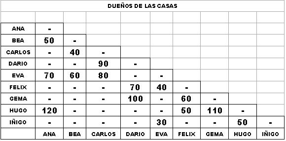

## Enunciado

En Matelandia se está renovando las tuberías generales de agua de toda la ciudad. Como es lógico, el encargado de este trabajo quiere aprovechar los antiguos conductos pero el alcalde le ha dicho que hay conductos que no son necesarios para que el agua llegue a todas las casas y que la longitud final de tubos debe ser la menor posible. En el ayuntamiento disponen de una tabla en la que se recogen las antiguas conexiones y los metros de tubos que eran necesarios. **Ayuda a realizar la nueva red de aguas y dinos la longitud de la tubería final.**

