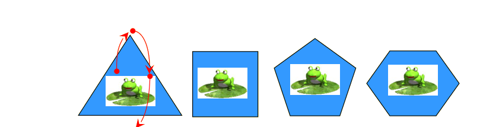

## Enunciado

Thales tenía una rana saltarina y les planteó un juego a sus discípulos:

1. Si la rana se encuentra en el interior de cada una de las figuras (triángulo, cuadrado, pentágono y hexágono) e intenta cruzar todos los lados de las mismas una y solo una vez, terminando fuera de la figura, ¿en cuántas de esas figuras puede la rana trazar un itinerario de dentro a fuera? Thales les demuestra a sus amigos que la rana puede hacerlo en el caso del triángulo. ¿Puedes encontrar una regla general para otras figuras? Justifica las respuestas.

2. Utilizando las mismas figuras geométricas que en el caso anterior, si la rana empieza y termina dentro de las figuras, ¿podría cruzar todos los lados una y solo una vez? ¿Se podría encontrar análogamente una regla general como en el caso anterior? Justifica las respuestas.

## Solución

Cada vez que la rana cruza un lado, cambia de estar dentro (D) a estar fuera (F) o al revés. Empieza dentro, así que tras cruzar los $n$ lados una vez cada uno su recorrido es D–F–D–F–…:

- Triángulo ($n = 3$): D–F–D–F, acaba **fuera**.
- Cuadrado ($n = 4$): D–F–D–F–D, acaba **dentro**.
- Pentágono ($n = 5$): D–F–D–F–D–F, acaba **fuera**.
- Hexágono ($n = 6$): D–F–D–F–D–F–D, acaba **dentro**.

(Se puede comprobar dibujando un itinerario en cada caso: siempre es posible cruzar cada lado una vez saltando de lado a lado.)

1. Puede ir de dentro a fuera en el **triángulo y el pentágono**. Regla general: es posible cuando el polígono (regular o no) tiene un **número impar de lados**.

2. Puede empezar y terminar dentro en el **cuadrado y el hexágono**: es posible cuando el polígono tiene un **número par de lados**.
