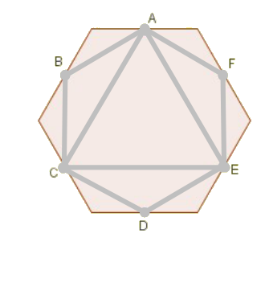

## Enunciado

Dos de las habitaciones de la casa del Sr. Cuesta dan a un patio interior, en el que hay otras 4 ventanas pertenecientes a pisos de los vecinos. El patio lo podemos ver como un polígono de 6 lados en el que cada ventana está en el centro de cada muro.

El Sr. Cuesta y sus vecinos quieren colgar cuerdas entre las ventanas del patio que utilizarán para tender la ropa mojada. Los estatutos de la comunidad establecen que las cuerdas deben cumplir las siguientes condiciones:

1. En cada ventana solo puede haber un número par de cuerdas.
2. Las cuerdas no se pueden cruzar entre sí.
3. Las cuerdas deben dividir al patio en triángulos.

¿Es posible colocar las cuerdas con estas condiciones? ¿Y si el patio fuese un heptágono con 7 ventanas? ¿Y si fuese un dodecágono con 12 ventanas? **Razona todas tus respuestas.**

## Solución

**Patio hexagonal.** Para que las esquinas del patio queden divididas en triángulos, cada ventana tiene que estar unida con sus dos vecinas (2 cuerdas). Hace falta además alguna ventana con más cuerdas; si es A, tendrá 4 (no puede tener más de 5, y 5 es impar). Probando las posibilidades, se descartan las que dejan una ventana con 3 cuerdas y queda una solución (y sus giros): unir las ventanas alternas A, C y E formando un triángulo. Así A, C y E tienen 4 cuerdas y B, D y F tienen 2.

**Patio heptagonal.** De nuevo cada ventana se une con sus dos vecinas y alguna ventana, digamos A, tiene 4 cuerdas (con 6, cuatro ventanas quedarían con un número impar). Estudiando las seis formas de dar 4 cuerdas a A, todas acaban dejando una ventana con un número impar de cuerdas o un cuadrilátero que no se puede dividir en triángulos sin incumplir la condición 1. **No es posible.**

**Patio dodecagonal.** Se reduce al hexágono: si unimos las ventanas B, D, F, H, J y L con sus vecinas y entre sí formando un hexágono con las ventanas A, C, E, G, I, K como «muros», basta repetir dentro la solución del patio hexagonal. **Sí es posible.**
