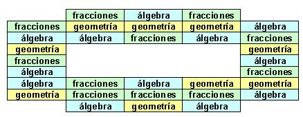
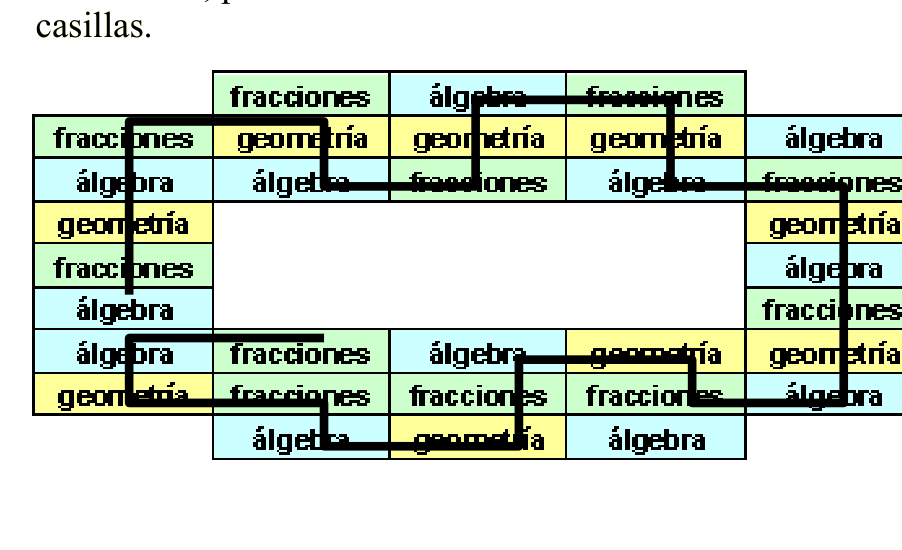

## Enunciado

Al llegar el verano, mi amiga Adita Lovelace ha diseñado una curiosa forma de repasar 2º de la ESO. Se ha creado una tarjeta con 32 casillas en la que ha escrito los tres temas que quiere estudiar: Geometría, Álgebra y Fracciones.

Para ello, ha decidido recorrer el mayor número posible de casillas, bajo las siguientes condiciones:

a) Podrá comenzar por la casilla que desee.

b) Se moverá una casilla por día, de forma horizontal o vertical.

c) No podrá pasar por la misma casilla dos veces.

d) No repetirá dos días seguidos el mismo tema (dicho de otro modo, si hoy pasa por «álgebra», mañana no puede ir a «álgebra»).

**¿Cuál es el mayor número posible de días que va a estudiar Adita Lovelace? ¿Qué camino recorrería? Razona la respuesta.**

## Solución

Los puntos conflictivos son las dos casillas de «álgebra» seguidas de una columna lateral y la acumulación de «fracciones» de la parte de abajo. Conviene empezar y terminar en ellos. Haciéndolo así, solo hay que dejar sin recorrer tres casillas (dos de álgebra y una de fracciones), y el máximo es de **29 días**. Un recorrido posible es el de la figura (hay pequeñas variaciones con el mismo número de casillas):

