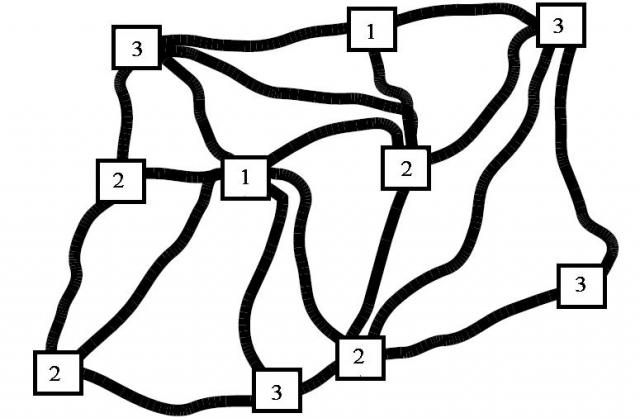
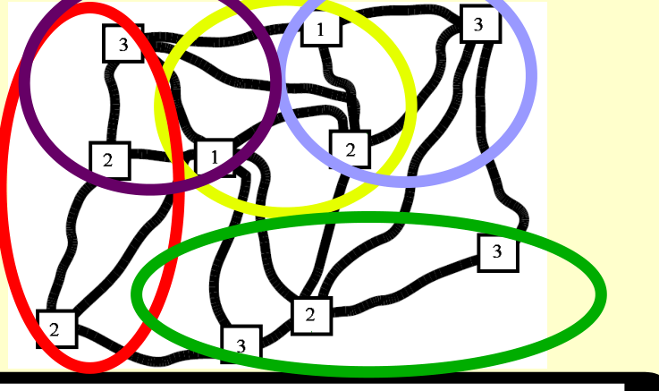

## Enunciado

Eulerina debe recaudar los parquímetros recién inaugurados de la ciudad de Samos. Hay tres tipos de parquímetros:

-- Zona 1: Siempre recaudan 480 € al día.

-- Zona 2: Siempre recaudan 240 € al día.

-- Zona 3: Siempre recaudan 160 € al día.

Al final de cada día su novio Gaussino le dejará en un parquímetro que ella elegirá y Eulerina decidirá qué ruta tomar para recoger la recaudación de tres parquímetros consecutivos. Al final de la semana (5 días laborables) deberá haber recogido recaudación al menos una vez de todos los parquímetros de la ciudad.

Teniendo en cuenta que el dinero no recaudado de un parquímetro se acumula al del siguiente día, **¿qué rutas deberá seguir cada uno de los cinco días Eulerina para conseguir la máxima recaudación al final de la primera semana de funcionamiento de los parquímetros? ¿Cuánto dinero recaudará al final de dicha semana?**

## Solución

Hay 2 parquímetros de la zona 1, 4 de la zona 2 y 4 de la zona 3. Lo que no se recauda un día se acumula, así que interesa dejar para el final los parquímetros que más recaudan, pero sin dejar ninguno sin recoger. Razonando desde el último día hacia atrás, una posible distribución de los tres parquímetros consecutivos de cada día (de modo que todos se recojan al menos una vez) es la de la figura:

| Día | Parquímetros (días acumulados) | Recaudación |
|---|---|---|
| 1.º | zona 1 (1), zona 2 (1), zona 3 (1) | 880 € |
| 2.º | zona 1 (2), zona 2 (2), zona 3 (2) | 1760 € |
| 3.º | zona 3 (3), zona 2 (3), zona 3 (3) | 1680 € |
| 4.º | zona 3 (3), zona 2 (3), zona 2 (4) | 2160 € |
| 5.º | zona 1 (4), zona 1 (3), zona 2 (3) | 4080 € |

Eulerina recauda en total **10 560 €**.
