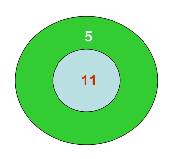

## Enunciado

Ana le propuso a Enrique jugar a los dardos con una diana muy especial, como la que aparece en la figura.

Ana le hizo la siguiente pregunta a Enrique: «Pudiendo disparar todas las veces que quieras y sumando siempre la puntuación obtenida a la anterior, ¿cuál es la puntuación máxima menor que 100 a la que no podrás llegar nunca?».

## Solución

Las puntuaciones posibles son las de la forma $5x + 11y$, con $x$ e $y$ el número de dardos en el 5 y en el 11. Agrupándolas según el número de onces:

- Con ningún 11: los múltiplos de 5 (acaban en 0 o 5).
- Con un 11: 11, 16, 21, 26, … (acaban en 1 o 6).
- Con dos: 22, 27, 32, … (acaban en 2 o 7).
- Con tres: 33, 38, 43, … (acaban en 3 u 8).
- Con cuatro: 44, 49, 54, … (acaban en 4 o 9).

Así, todos los números que acaban en 4 o 9 se consiguen a partir del 44; los que acaban en 3 u 8, a partir del 33, etc. Los que no se pueden conseguir son 1, 2, 3, 4, 6, 7, 8, 9, 12, 13, 14, 17, 18, 19, 23, 24, 28, 29, 34 y 39. A partir del 40 se pueden conseguir todos.

La mayor puntuación que nunca se puede conseguir es **39**. (En general, con dos números primos entre sí $a$ y $b$, es $ab - a - b = 55 - 5 - 11 = 39$.)
