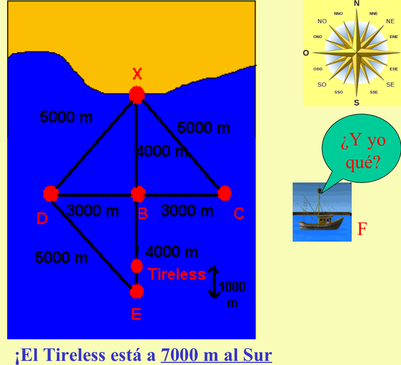

## Enunciado

El submarino nuclear británico Tireless se dirige a Gibraltar para una reparación rutinaria. En un punto frente a la costa de Huelva se pierde su señal. El gobierno británico, manda un grupo de expertos para localizarlo, que se sitúa en la playa de Punta Umbría, disfrazados de pescadores de coquinas, posición que llamamos X. Había en la zona varios barcos pescando chocos, que rotulamos de B a F. Los datos de sus posiciones relativas, en el momento de la desaparición, que pudo obtener el grupo de expertos es:

- El barco D estaba a 5000 m. de X.

- D estaba a 3000 m. hacia el oeste de B.

- D estaba a 1000 m. de F.

- E estaba más próximo de F que X.

- E estaba a 4000 m. de B.

- E estaba a 5000 m. de D.

- B estaba a 4000 m. de X.

- E estaba a 1000 m. del Tireless

- B estaba a 3000 m. de C.

- C estaba a 5000 m. de X.

- F estaba un poco al sur, pero sobre todo, al oeste de C y a unos 6000 m. de distancia.

- El Tireless estaba entre B y E.

**¿Dónde se encuentra el Tireless con respecto a X?**

## Solución

- D está a 5000 m de X, B a 4000 m de X y D a 3000 m al oeste de B. Como $3000^2 + 4000^2 = 5000^2$, el triángulo XBD es rectángulo en B: **B está 4000 m al sur de X** y D, 3000 m al oeste de B.
- C está a 3000 m de B y a 5000 m de X: por la misma razón, C está 3000 m al este de B.
- E está a 4000 m de B y a 5000 m de D: el triángulo DBE es rectángulo en B, así que E está 4000 m al sur de B (al norte estaría X).
- El Tireless está entre B y E, a 1000 m de E.

El Tireless está **7000 m al sur de X** (Punta Umbría).
