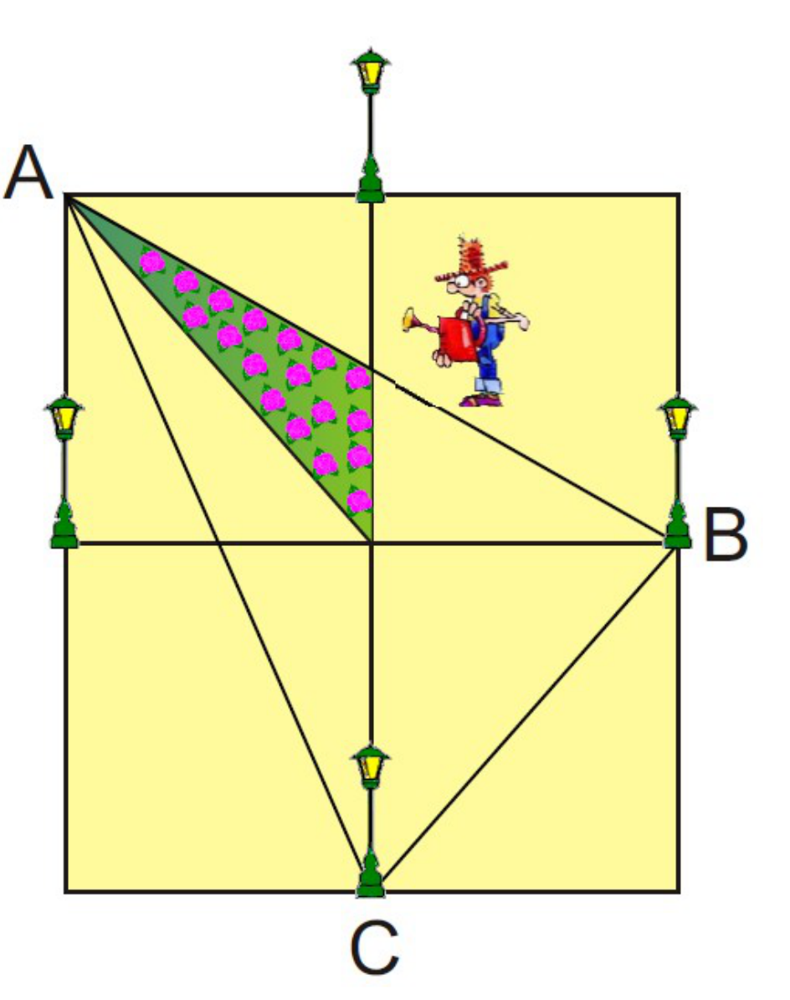

## Enunciado

D. Mileto Remidelotodo es el topógrafo oficial de Todolandia. Su último trabajo ha sido realizar el plano del nuevo jardín que se construirá a la entrada del I.E.S. Thales y que estará alumbrado por cuatro farolas situadas en los puntos medios de sus lados.

La parte sombreada, de 5 m², son los rosales que se han plantado hasta ahora. **Razonando la respuesta, calcula la superficie del jardín completo y de la zona destinada a la plantación de los rosales limitada por el triángulo ABC.**

## Solución

Llamamos O al centro del jardín, P al punto medio del lado superior (donde está la farola de arriba) y M al punto en que la diagonal AB corta al segmento vertical OP. El triángulo sombreado es AMO, de 5 m².

Por el teorema de Thales, como B es el punto medio del lado derecho, M es el punto medio de OP: $OM = MP$. Los triángulos AMO y AMP tienen bases iguales ($OM = MP$) y la misma altura (la distancia de A a la recta OP), así que AMP también mide 5 m², y el triángulo AOP mide 10 m².

**Jardín completo.** El rectángulo de vértices A, P, O y el punto medio del lado izquierdo es el doble de AOP, 20 m², y el jardín está formado por cuatro rectángulos iguales:

$$4 \cdot 20 = 80 \text{ m}^2.$$

**Triángulo ABC.** Lo descomponemos en triángulos de los que conocemos el área (comparando bases y alturas): AMO (5 m²), AOM' (5), M'OC (5), OBC (10) y MBO (5), donde M' es el punto simétrico de M. En total:

$$5 + 5 + 5 + 10 + 5 = 30 \text{ m}^2.$$
