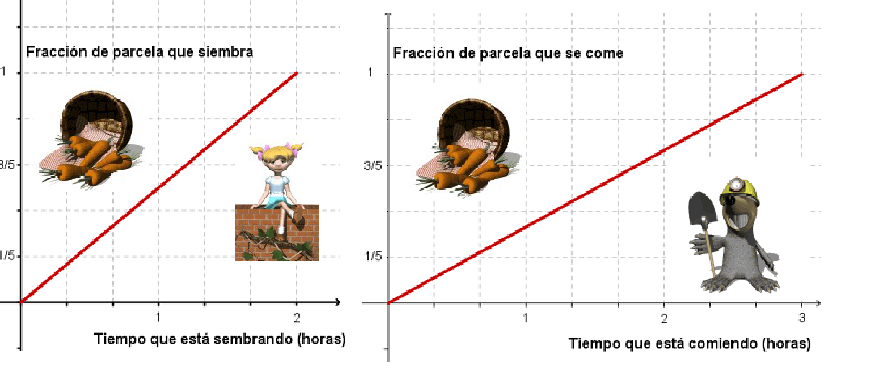

## Enunciado

Blanca es una jardinera muy experimentada. Tiene todo su huerto preparado para plantarlo de zanahorias. Sin embargo, en el huerto vive un topillo que es capaz de comerse todo lo plantado.

Esta mañana, Blanca ha empezado a plantar zanahorias a las 9 de la mañana, pero, al mismo tiempo, el topillo ha empezado a «hacer de las suyas». A la vista de las gráficas, **¿a qué hora conseguirá Blanca tener todo el huerto plantado?**

**Razona la respuesta.**

## Solución

En las gráficas se ve que Blanca siembra toda la parcela en 2 horas y que el topillo se la come entera en 3 horas. En una hora:

- Blanca siembra $\frac{1}{2}$ de la parcela.
- El topillo se come $\frac{1}{3}$ de la parcela.

Cada hora queda sembrado realmente $\frac{1}{2} - \frac{1}{3} = \frac{1}{6}$ de la parcela, así que Blanca necesita 6 horas. Si empezó a las 9:00, terminará **a las 15:00**.
