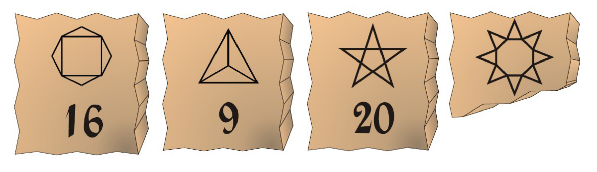

## Enunciado

En las excavaciones que está realizando en Matelandia la famosa arqueóloga Lara Descifralotodo, ha encontrado restos de tablillas de arcilla con datos e ilustraciones estelares.

La última tablilla está en muy mal estado y no ha podido descifrar el dato. **¿Podrías ayudar a nuestra arqueóloga diciéndole el número que corresponde a la misma?** No olvides explicar cómo lo has averiguado, ya que Lara es una científica muy rigurosa y no se deja convencer fácilmente.

**Dibuja una figura estelar que corresponda al número 12.**

## Solución

Es un problema abierto: hay que encontrar una relación entre cada figura y su número que valga para las tres tablillas conocidas.

Una relación sencilla es contar el **número de ángulos interiores de los polígonos que forman la figura**:

- En la segunda figura hay tres triángulos: $3 \cdot 3 = 9$ ángulos.
- En la tercera, la estrella de cinco puntas, hay cinco triángulos y un pentágono: $5 \cdot 3 + 5 = 20$.
- En la primera, sumando del mismo modo los ángulos de los polígonos que la forman, salen 16.
- En la cuarta, la estrella de seis puntas, contando así todos los ángulos se obtienen **32**.

El dato de la cuarta tablilla es **32**. Otras relaciones que también funcionan (por ejemplo, el número de segmentos más el número de triángulos) llevan al mismo resultado.

Para el número 12 basta dibujar una figura formada por polígonos con 12 ángulos en total: por ejemplo, cuatro triángulos, tres cuadriláteros, un hexágono y dos triángulos, o dos hexágonos.
