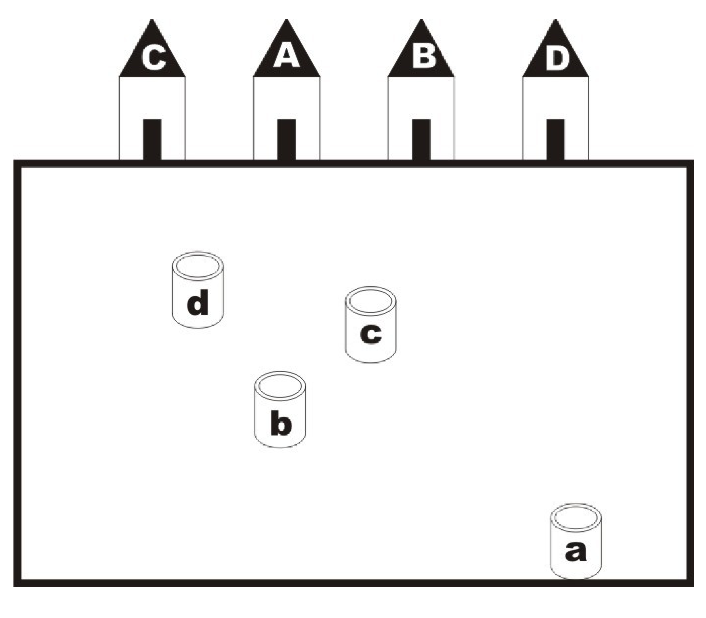

## Enunciado

El famoso ingeniero de caminos, canales y puertos D. Eulerín Construyelotodo está proyectando el trazado de 4 canalizaciones de abastecimiento de agua que unan las casas A, B, C y D de la Urbanización Buenavista de Todolandia con sus respectivos pozos a, b, c y d. Las canalizaciones no se deben cruzar entre sí, ni salir del vallado de la Urbanización.

**Ayúdale pintando dichas canalizaciones en el plano.**

## Solución

Las casas están en el orden C, A, B, D, y los pozos están mezclados, así que las canalizaciones no pueden ir en línea recta: hay que rodear unos pozos con las tuberías de otros. Una forma de hacerlo es empezar por las que van a los pozos más fáciles y hacer que las siguientes «envuelvan» a las anteriores, sin salir del vallado. Por ejemplo, se puede unir primero A con a dando un rodeo por el lado derecho del recinto, después B con b rodeando el pozo c por arriba, etc. Hay varias soluciones posibles.
