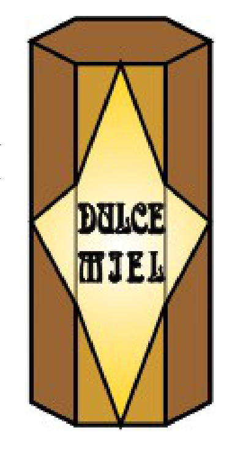

## Enunciado

En una fábrica de dulce miel han decidido hacer envases con forma de celda de colmena. El perímetro de la base es 24 cm y su altura es 16 cm. Para etiquetarlas utilizan pegatinas con forma de rombo como las del dibujo. **¿Cuánto mide el lado de la pegatina?**

**Razona la respuesta.**

## Solución

El envase es un prisma hexagonal regular. Su base tiene 24 cm de perímetro, así que cada lado mide $24 : 6 = 4$ cm.

Al desplegar el prisma, la pegatina es un rombo que ocupa la cara frontal y las dos caras contiguas. Lo dividimos en cuatro triángulos rectángulos iguales por sus diagonales. En cada uno:

- el cateto vertical es la mitad de la altura: $16 : 2 = 8$ cm;
- el cateto horizontal es la mitad de la diagonal horizontal del rombo, que abarca las tres caras ($3 \cdot 4 = 12$ cm): 6 cm.

Por el teorema de Pitágoras, el lado de la pegatina mide

$$\sqrt{6^2 + 8^2} = \sqrt{100} = 10 \text{ cm}.$$
