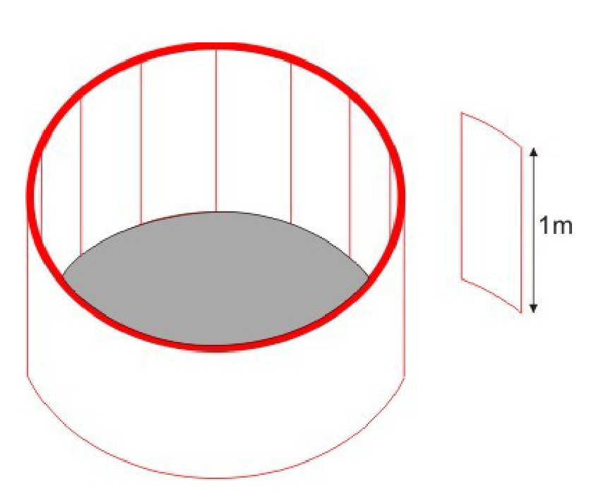

## Enunciado

El nuevo modelo de piscina infantil diseñado por Esbelto Decoralotodo es cilíndrico, de un metro de profundidad, y está recubierto por 16 piezas idénticas de 1 m², como la que se muestra en la figura.

Pero el Sr. Decoralotodo tiene un problema, ya que no sabe cuál es la capacidad de este modelo de piscina. **Ayúdale calculando los litros de agua que hacen falta para llenarla.**

**Razona la respuesta.**

## Solución

Cada pieza tiene 1 m² de superficie y 1 m de altura, así que su base curva mide 1 m. Las 16 piezas rodean la piscina, de modo que la circunferencia de la base mide 16 m:

$$2\pi r = 16 \;\Rightarrow\; r = \frac{8}{\pi} \text{ m}.$$

El volumen del cilindro, de 1 m de altura, es

$$\pi r^2 \cdot 1 = \pi \cdot \frac{64}{\pi^2} = \frac{64}{\pi} \text{ m}^3 \approx 20{,}37 \text{ m}^3.$$

Hacen falta $\frac{64\,000}{\pi} \approx$ **20 372 litros**.
