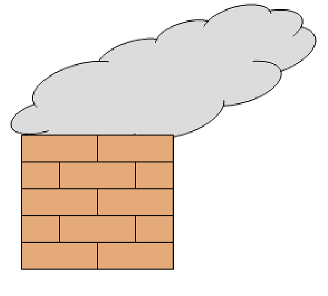

## Enunciado

La millonaria Tamara Quierolotodo ha mandado construir una magnífica mansión en Todolandia. Al presentarle los planos, fijó su vista en el de la figura, que representa el perfil de la chimenea de planta cuadrada a situar sobre el tejado.

Como le parecía que iba a quedar pequeña para su mansión, ordenó que aumentasen al doble las dimensiones (largo, ancho y alto) de la chimenea. **Calcula cuántos ladrillos eran necesarios para construir la primitiva chimenea del plano y cuántos serán precisos para la nueva.**

**Razona las respuestas.**

NOTA: Los ladrillos que se utilizan no se pueden cortar.

## Solución

La chimenea es hueca y de planta cuadrada, así que hay que imaginarla en tres dimensiones. En el perfil se ven ladrillos de frente (enteros) y de canto (medios ladrillos, que en realidad son ladrillos de la pared contigua). Como la planta es cuadrada, los cuatro lados son iguales, y en cada piso se alternan las posiciones.

**Chimenea inicial.** Tiene 5 pisos y cada lado mide 2 ladrillos. Reconstruyendo dos perfiles contiguos, en cada piso hay 3 ladrillos completos entre las dos paredes (el medio ladrillo de la esquina pertenece a la otra pared). Por simetría, cada piso tiene $2 \cdot 3 = 6$ ladrillos, y la chimenea, $6 \cdot 5 =$ **30 ladrillos**.

**Chimenea nueva.** Al doblar las dimensiones tiene 10 pisos y cada lado mide 4 ladrillos; ahora hay 7 ladrillos completos entre dos paredes contiguas. Cada piso tiene $2 \cdot 7 = 14$ ladrillos y la chimenea, $14 \cdot 10 =$ **140 ladrillos** (no el doble ni el óctuple, porque la chimenea es hueca).
