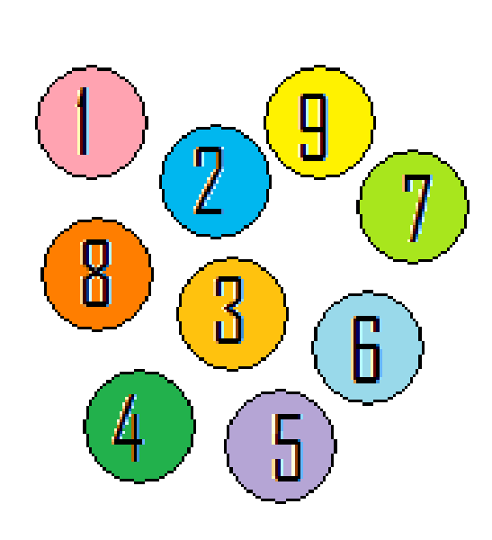

## Enunciado

Mi amigo Eulogio dice que tiene en su bolsillo nueve fichas de igual aspecto, en las que están impresos los números del 1 al 9. Me plantea el siguiente juego: él sacará dos fichas al azar de su bolsillo y, si la suma de las puntuaciones es más de 11, yo gano. En caso contrario, él gana. **¿Qué posibilidades tengo de ganar? ¿Debería jugar contra él?**

Poco después me plantea el mismo juego, pero esta vez me dice que sacará tres fichas. Si la suma de las fichas es mayor que 17, yo gano. En los demás casos, él gana. **¿Han aumentado o disminuido mis posibilidades de ganar ahora? ¿Cuál de los dos juegos sería más ventajoso para mí?**

**Razona tus respuestas.**

## Solución

**Dos fichas.** Hay $\frac{9 \cdot 8}{2} = 36$ parejas posibles. La suma es mayor que 11 en las parejas 3-9, 4-8, 4-9, 5-7, 5-8, 5-9, 6-7, 6-8, 6-9, 7-8, 7-9 y 8-9: **12 de 36**, es decir, $\frac{1}{3}$. No me conviene jugar.

**Tres fichas.** Hay $\frac{9 \cdot 8 \cdot 7}{6} = 84$ tríos posibles, y en **23** la suma es mayor que 17 (por ejemplo, con el 1 solo vale $1 + 8 + 9$). La probabilidad es $\frac{23}{84} \approx 0{,}27$. Tampoco me conviene jugar.

Mis posibilidades **han disminuido**: $\frac{12}{36} \approx 0{,}33 > \frac{23}{84} \approx 0{,}27$. El primer juego es más ventajoso para mí (aunque ninguno de los dos es favorable).
