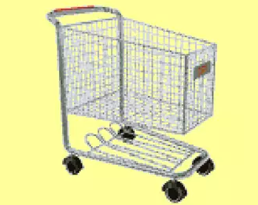

## Enunciado

Alex, María y Elena están en el supermercado con sus padres respectivos. Mientras esperan en la cola de la caja deciden jugar a ver quién adivina cuánto dinero hay juntando las tres monedas que han metido sus padres en los carros. Tienen genes matemáticos, por eso no responden al tuntún, sino que hacen cálculos sabiendo que los carros aceptan monedas de 50 céntimos, 1 euro y 2 euros.

- ¿Por qué nadie dice 5,5 euros?
- ¿Qué cantidad deberían decir para tener más posibilidad de acertar?

Para seguir divirtiéndose, también deciden jugar si la cantidad es exacta o decimal.

- En este segundo juego, ¿quién tendría más posibilidad de acertar?
- ¿En cuál de los dos juegos es más fácil ganar?

**Razona las respuestas.**

## Solución

- Para llegar a 5,5 € con tres monedas haría falta, por ejemplo, $2 + 2 + 1{,}5$, pero no hay monedas de 1,5 €: con 0,50, 1 y 2 € las únicas sumas que acaban en 50 céntimos llevan una o tres monedas de 50 céntimos, y la mayor es $0{,}50 + 2 + 2 = 4{,}50$ €. Por eso **nadie dice 5,5 €**.
- Cada padre puede haber puesto cualquiera de las tres monedas: hay $3 \cdot 3 \cdot 3 = 27$ casos, con estas sumas:

| Total (€) | 1,50 | 2 | 2,50 | 3 | 3,50 | 4 | 4,50 | 5 | 6 |
|---|---|---|---|---|---|---|---|---|---|
| Casos | 1 | 3 | 3 | 4 | 6 | 3 | 3 | 3 | 1 |

La cantidad más probable es **3,50 €** (6 casos de 27, un 22 %).

- En el segundo juego, la cantidad es exacta en $3 + 4 + 3 + 3 + 1 = 14$ casos y decimal en 13: conviene apostar por **exacta** (14 de 27, un 52 %).
- **Es más fácil ganar en el segundo juego**: apostando bien se acierta un 52 % de las veces, frente al 22 % del primero.
