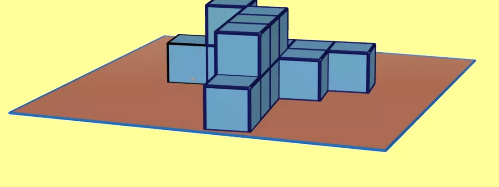

## Enunciado

El profesor D. Anacleto Enseñalotodo va paseando con sus alumnos y alumnas por un museo y, al encontrarse con los siguientes cubos de 1 metro de arista apilados sobre el suelo, les plantea las siguientes cuestiones:

- ¿Cuál es el volumen de la figura formada por los cubos?
- Si pintáramos de rojo las caras que se pueden ver, ¿cuántos cubos tienen exactamente una, dos, tres, cuatro y cinco caras coloreadas?

**Razona las respuestas.**

## Solución

La figura está formada por 14 cubos de 1 m³: su volumen es **14 m³**.

Las caras que se ven son las que no están apoyadas en el suelo ni en contacto con otro cubo. Estudiando los cubos uno a uno (en la solución original se recorren con una tabla), se obtiene:

| Caras coloreadas | 1 | 2 | 3 | 4 | 5 |
|---|---|---|---|---|---|
| Número de cubos | 1 | 5 | 2 | 5 | 1 |
