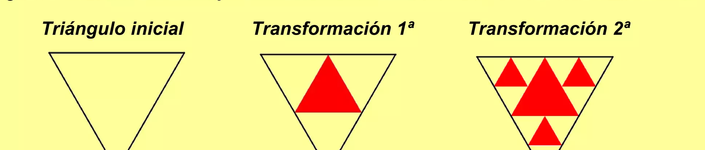
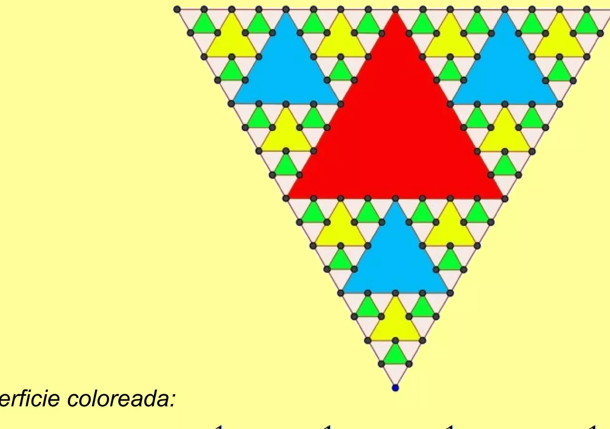

## Enunciado

*(In memoriam Benoit Mandelbrot, «padre de los fractales»)*

Todos los estudiantes de Todolandia andan como locos intentando calcular las superficies de todos los triángulos equiláteros coloreados que se van obteniendo al ir uniendo los puntos medios de los lados de los triángulos no coloreados, como se observa en las figuras.

Sabiendo que el triángulo equilátero del que se parte tiene como superficie la unidad, ayúdales calculando la superficie que está coloreada después de haber realizado 2 transformaciones.

¿Cuál es la superficie que se obtiene después de 4 transformaciones? ¿Cómo calcularías la superficie coloreada tras realizar *n* transformaciones?

## Solución

En cada transformación, cada triángulo sin colorear se divide en 4 iguales y se colorea el central: se colorea $\frac{1}{4}$ de cada triángulo blanco y quedan 3 triángulos blancos, cada uno de $\frac{1}{4}$ del anterior.

- Transformación 1.ª: se colorea $\frac{1}{4}$.
- Transformación 2.ª: se añaden $3 \cdot \frac{1}{16}$; en total, $\frac{1}{4} + \frac{3}{16} = \frac{7}{16}$.
- Transformación 3.ª: $\frac{7}{16} + 9 \cdot \frac{1}{64} = \frac{37}{64}$.
- Transformación 4.ª: $\frac{37}{64} + 27 \cdot \frac{1}{256} = \frac{175}{256}$.

Tras $n$ transformaciones, la superficie coloreada es

$$\frac{1}{4} + \frac{3}{4^2} + \frac{3^2}{4^3} + \dots + \frac{3^{n-1}}{4^n}.$$

Es más fácil fijarse en lo que queda sin colorear: en cada paso queda blanca $\frac{3}{4}$ de la superficie blanca anterior, así que tras $n$ pasos queda $\left(\frac{3}{4}\right)^n$ y la parte coloreada es

$$1 - \left(\frac{3}{4}\right)^n.$$

(Por ejemplo, $1 - \frac{81}{256} = \frac{175}{256}$ para $n = 4$.)
