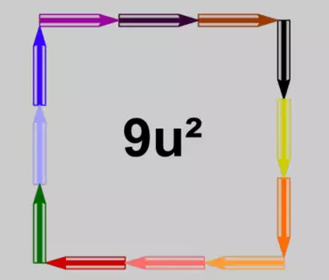
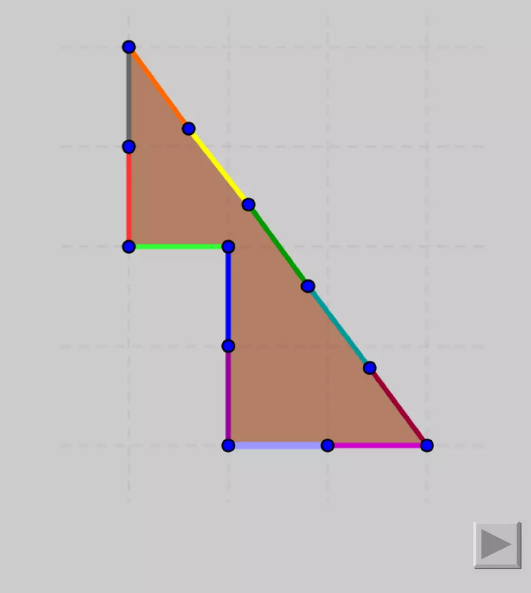
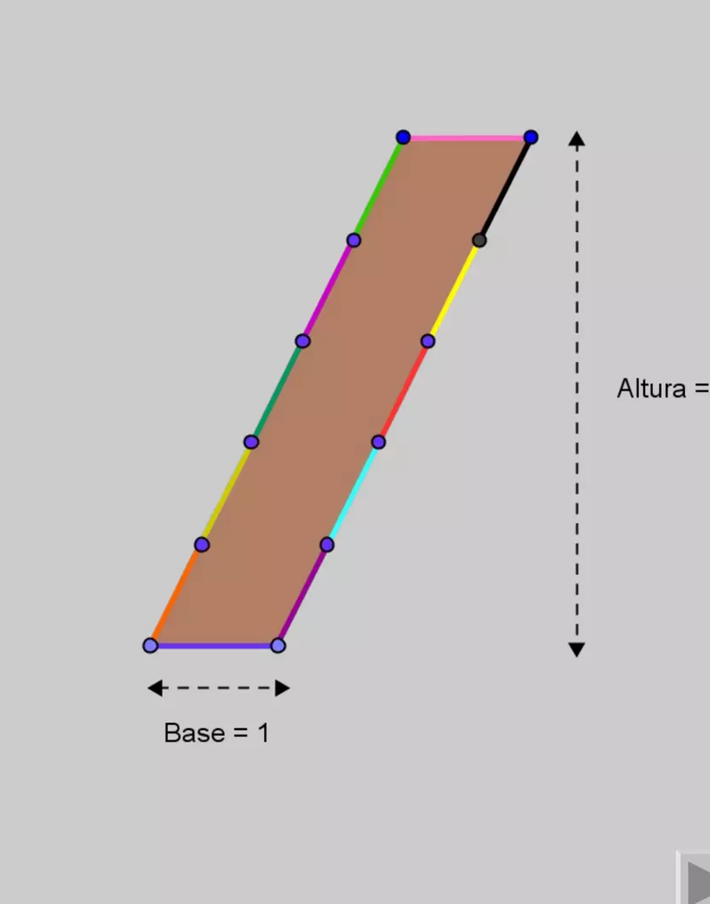

## Enunciado

A Joaquín de Thales le han regalado una caja de 12 colores; ha sacado todos los lápices y ha formado la siguiente figura:

Su hermana María, a quien le gusta mucho jugar con formas y colores, se hace las siguientes preguntas:

- ¿Podré crear dos figuras de área 5 u² sin variar el perímetro de la figura?
- ¿Y otras dos de área 6 u² en las mismas condiciones?
- ¿Y otras dos de área 4 u² igualmente?

Intenta ayudar a María y razona tus respuestas.

## Solución

Cada lápiz mide 1 unidad, así que todas las figuras deben tener 12 unidades de perímetro.

**Área 5 u².** Por ejemplo, el rectángulo de $1 \times 5$ (perímetro $2 \cdot (1 + 5) = 12$) o muchas de las figuras del pentominó formadas por 5 cuadrados.

**Área 6 u².** El triángulo rectángulo de catetos 3 y 4 e hipotenusa 5 tiene perímetro $3 + 4 + 5 = 12$ y área $\frac{3 \cdot 4}{2} = 6$. También sirven figuras de 6 cuadraditos que contengan un bloque de $2 \times 2$, o figuras que se obtienen cortando y recolocando el triángulo:

**Área 4 u².** Con cuadraditos no es posible (cuatro cuadrados dan como mucho perímetro 10), pero sí con un paralelogramo de base 1 y lado oblicuo 5 con altura 4: perímetro $1 + 5 + 1 + 5 = 12$ y área $1 \cdot 4 = 4$. (Como $\sqrt{3^2 + 4^2} = 5$, el lado oblicuo une dos puntos de la cuadrícula.)

Hay muchas otras soluciones.
