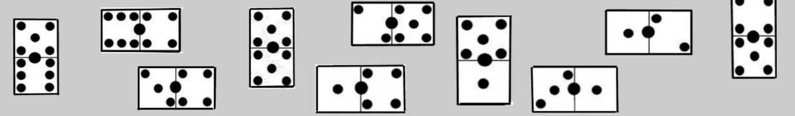
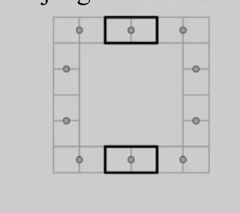
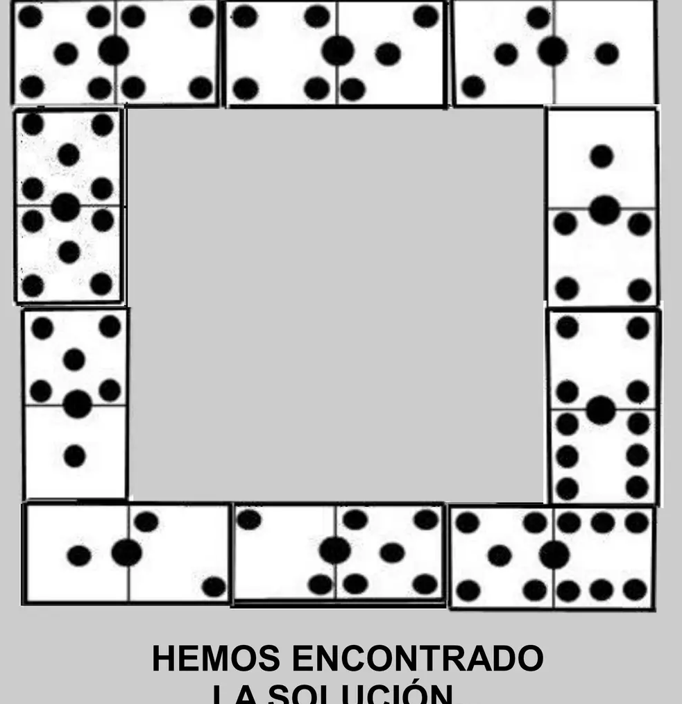

## Enunciado

El juego de moda este otoño en Todolandia es el dominó y andan los todolandeses todo el día jugueteando con las fichas del mismo.

Luisito Dominalotodo quiere formar un cuadrado con las 10 fichas de arriba (cumpliendo con las normas del juego, es decir, deben estar unidas por el mismo valor).

Pero quiere que las fichas más representativas estén colocadas en el centro del lado superior e inferior del mismo, y coincidan o sean las que más se aproximen a la media de los puntos de las 10 fichas utilizadas.

Ayuda a Luisito Dominalotodo colocando correctamente en el dibujo del cuadrado, en primer lugar, las 2 fichas centrales y, a continuación, las 8 fichas restantes siguiendo las reglas del juego del dominó.

**Razona las respuestas.**

## Solución

Las 10 fichas suman 72 puntos, así que la media es $72 : 10 = 7{,}2$ puntos por ficha. Ninguna tiene 7,2 puntos; las más próximas son las de 7 puntos, el **4-3** y el **5-2**, que van en el centro de los lados superior e inferior.

A partir de ellas se colocan las demás, uniendo siempre mitades con el mismo número de puntos y cerrando el cuadrado:

