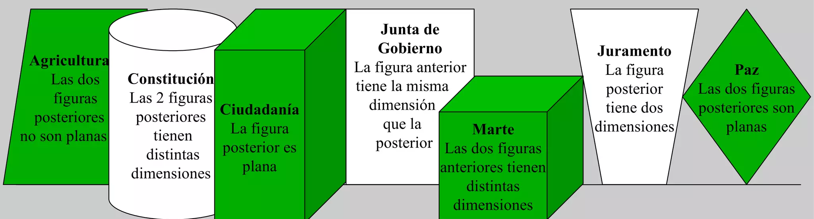
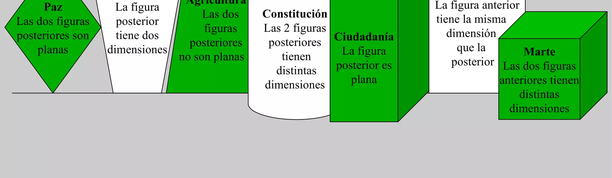

## Enunciado

Mirando de frente el monumento a las Cortes, hay varios grupos escultóricos y bajorrelieves que representan aspectos importantes de 1812. Los hemos reflejado en estas figuras andaluzas (verdes y blancas) de 2 y 3 dimensiones.

| Figura | Forma | Condición |
|---|---|---|
| Agricultura | paralelogramo (plana) | Las dos figuras posteriores no son planas. |
| Constitución | cilindro | Las 2 figuras posteriores tienen distintas dimensiones. |
| Ciudadanía | prisma | La figura posterior es plana. |
| Junta de Gobierno | rectángulo (plana) | La figura anterior tiene la misma dimensión que la posterior. |
| Marte | cubo | Las dos figuras anteriores tienen distintas dimensiones. |
| Juramento | trapecio (plana) | La figura posterior tiene dos dimensiones. |
| Paz | rombo (plana) | Las dos figuras posteriores son planas. |

Ordénalas tal y como estarían en el monumento si todas estuvieran a la misma altura para que se cumplan todas las condiciones que aparecen en las figuras. **Razona la respuesta.**

## Solución

Hay cuatro figuras planas (Agricultura, Junta de Gobierno, Juramento y Paz) y tres de tres dimensiones (Constitución, Ciudadanía y Marte).

- Detrás de Agricultura van dos figuras de 3 dimensiones, y detrás de Constitución, una de 3 y una plana. Ciudadanía, que va seguida de una plana, encaja después de Constitución: **Agricultura, Constitución, Ciudadanía, plana**.
- Junta de Gobierno tiene delante y detrás figuras de la misma dimensión; si es la plana que sigue a Ciudadanía, detrás va otra de 3 dimensiones: **Marte**, cuyas dos anteriores (Ciudadanía y Junta) tienen distintas dimensiones. ✓
- Delante de Agricultura quedan Paz y Juramento: Juramento va justo delante de Agricultura (plana) y Paz delante de Juramento, con dos planas detrás. ✓

El orden es: **Paz, Juramento, Agricultura, Constitución, Ciudadanía, Junta de Gobierno y Marte**.

