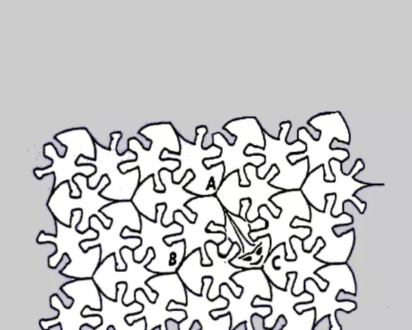
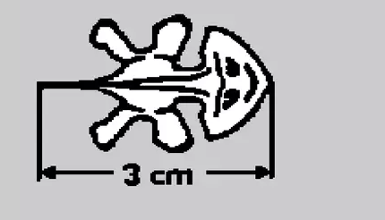
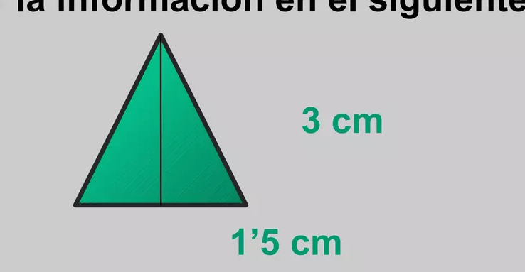

## Enunciado

La imagen del margen representa un nido de reptiles de una rara especie, los «lagartos planos revueltos». Son planos, tienen todos la misma silueta, el mismo tamaño y la propiedad de poder acoplarse sin dejar huecos entre ellos.

El individuo que ha abierto los ojos mide exactamente 3 cm desde la punta de su mentón hasta la extremidad de su cola afilada, tal y como se representa en la siguiente figura.

Calcula el área de este simpático espécimen (haz uso del triángulo ABC). **Razona la respuesta.**

## Solución

En el nido, tres lagartos se acoplan de modo que, si unimos sus mentones (los puntos A, B y C), se forma un triángulo equilátero cuyos lados miden lo mismo que un lagarto, 3 cm. Ese triángulo contiene las mitades de tres lagartos, así que el área de un lagarto es $\frac{2}{3}$ del área del triángulo.

La altura del triángulo, por el teorema de Pitágoras, es

$$h = \sqrt{3^2 - 1{,}5^2} = \sqrt{6{,}75} \approx 2{,}598 \text{ cm},$$

y su área, $\frac{3 \cdot 2{,}598}{2} \approx 3{,}897$ cm². El lagarto mide

$$\frac{2}{3} \cdot 3{,}897 \approx 2{,}598 \text{ cm}^2.$$
