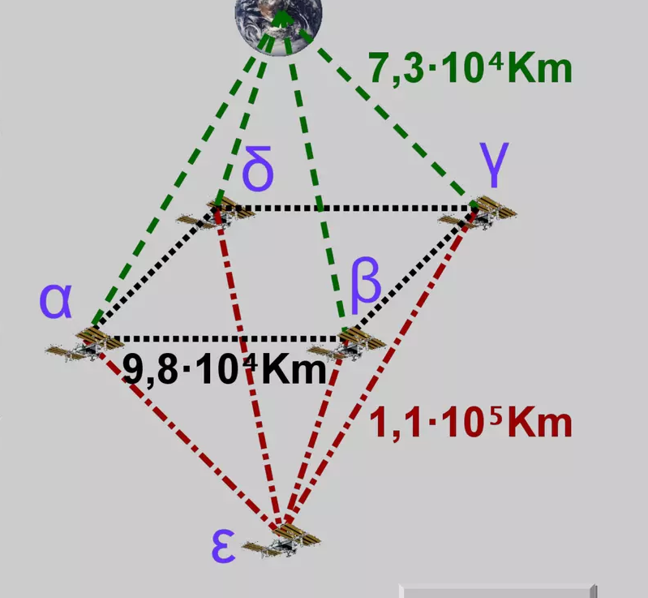

## Enunciado

En el año 12002 todos los habitantes de la Tierra y de las 5 Estaciones Espaciales conmemoran los 200 lustros de las rutas que puedes ver en el dibujo.

Para esta conmemoración se ha reparado una de las antiguas naves, manteniendo la autonomía de vuelo de $1{,}2 \cdot 10^5$ km. Y va a realizar viajes gratuitos desde la Tierra hasta la más nueva de las Estaciones, ε, parando a repostar cuando sea necesario.

¿Cuántos trayectos diferentes puede hacer si en cada trayecto no para dos veces en la misma estación? ¿Qué longitud tiene cada uno de ellos?

La Tierra está equidistante de las estaciones α, β, γ y δ, que forman un cuadrado (como observas en el dibujo), y estas equidistan de la estación ε.

## Solución

Cada tramo es más corto que la autonomía de la nave, pero dos tramos seguidos ya no ($7{,}3 \cdot 10^4 + 9{,}8 \cdot 10^4 = 1{,}71 \cdot 10^5 > 1{,}2 \cdot 10^5$ km): hay que repostar en cada estación por la que se pasa. Un trayecto va de la Tierra a una de las cuatro estaciones del cuadrado, recorre 0, 1, 2 o 3 lados del cuadrado sin repetir estación y termina en ε.

- 0 lados: 4 trayectos de $7{,}3 \cdot 10^4 + 1{,}1 \cdot 10^5 = 1{,}83 \cdot 10^5$ km.
- 1 lado: $4 \cdot 2 = 8$ trayectos de $1{,}83 \cdot 10^5 + 0{,}98 \cdot 10^5 = 2{,}81 \cdot 10^5$ km.
- 2 lados: 8 trayectos de $3{,}79 \cdot 10^5$ km.
- 3 lados: 8 trayectos de $4{,}77 \cdot 10^5$ km.

En total hay $4 + 8 + 8 + 8 =$ **28 trayectos** distintos.
