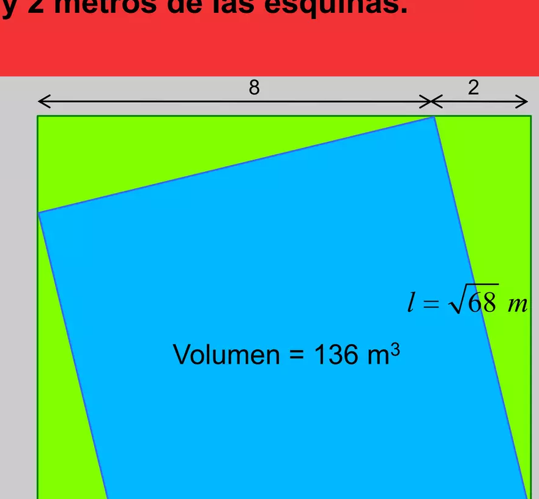

## Enunciado

Mis vecinos quieren construir en un terreno cuadrado cuyos lados miden 10 m una piscina cuadrada inscrita en el mismo. Ellos quieren que tenga una profundidad de 2 metros y un volumen de agua de 136 m³.

El constructor les presenta el plano de una piscina (ver figura), con el que los dueños no están de acuerdo, y para demostrárselo calculan el volumen de agua que cabe en ella.

¿Cuál es el volumen de la piscina proyectada por el constructor? Dibuja cómo debería ser el plano de la piscina deseada por mis vecinos. **Razona las respuestas.**

## Solución

**Piscina del constructor.** Sus vértices están en los puntos medios de los lados, así que cada lado de la piscina es la hipotenusa de un triángulo rectángulo de catetos 5 y 5 m: mide $\sqrt{50}$ m y la piscina tiene $50$ m² de superficie y $50 \cdot 2 =$ **100 m³** de volumen.

**Piscina deseada.** Para 136 m³ con 2 m de profundidad hace falta una superficie de $68$ m². Si cada vértice divide el lado del terreno en dos trozos de $x$ y $10 - x$ metros, por Pitágoras

$$x^2 + (10 - x)^2 = 68 \;\Rightarrow\; x^2 - 10x + 16 = 0 \;\Rightarrow\; x = 2 \text{ u } x = 8.$$

Los vértices de la piscina deben estar a **2 m (y 8 m) de las esquinas** del terreno.

