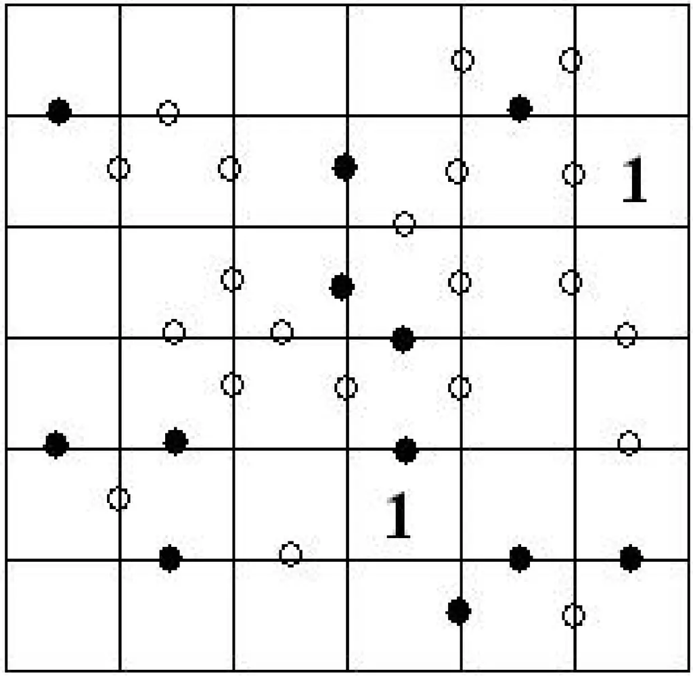

## Enunciado

En casa de mi amigo Pascalín me han propuesto una variedad del juego del sudoku. Se trata de colocar los números del 1 al 6 dispuestos en filas y columnas sin que se repitan, de manera que dos casillas que compartan punto negro sean una el doble de la otra y, si comparten punto blanco, sean números consecutivos. ¿Podrías completar este sudoku tan especial?

**Razona la respuesta.**

## Solución

Un punto negro solo puede unir las parejas 1-2, 2-4 o 3-6, y un punto blanco, dos números consecutivos. Conviene empezar por las cadenas de puntos negros, que son las más restrictivas: tres casillas seguidas unidas por dos puntos negros solo pueden contener 1, 2 y 4 (con el 2 en medio), y si una de ellas está junto a un 1 dado, el resto queda determinado. A partir de ahí, combinando cada punto con la regla de no repetir en filas y columnas (y preguntándose qué número falta en cada fila o columna casi completa), se va rellenando el tablero casilla a casilla hasta obtener:

| | | | | | |
|---|---|---|---|---|---|
| 2 | 6 | 1 | 5 | 4 | 3 |
| 4 | 5 | 6 | 3 | 2 | **1** |
| 1 | 3 | 2 | 4 | 5 | 6 |
| 6 | 4 | 3 | 2 | 1 | 5 |
| 3 | 2 | 5 | **1** | 6 | 4 |
| 5 | 1 | 4 | 6 | 3 | 2 |

(En negrita, los dos números que daba el enunciado.)
