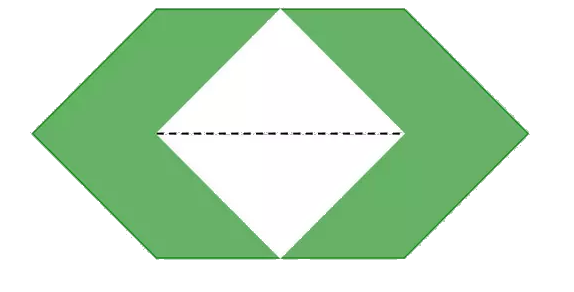

## Enunciado

Todos los zócalos de todas las calles de Todolandia están alicatados con azulejos cuadrados de 30 cm de lado.

Sin embargo, todas las ciudades de las regiones orienTHALES se han querido diferenciar de las demás y para ello han diseñado sus propios azulejos, pero por falta de recursos han reciclado todos los que poseían.

Todos los azulejos orienTHALES han sido construidos cortando a los cuadrados dos esquinas opuestas (a 15 cm de distancia de los vértices); a continuación han girado 90° el resto del azulejo y les han pegado estos dos trozos cortados encima, en el centro (de la forma en que se ve la figura), y por último han coloreado el resto del azulejo.

Calcula la superficie de uno de estos azulejos orienTHALES y el área de la zona que tiene coloreada.

**Razona las respuestas.**

## Solución

El azulejo original mide $30^2 = 900$ cm².

Los trozos cortados en las esquinas son triángulos rectángulos isósceles de catetos 15 cm; juntos forman un cuadrado de 15 cm de lado, así que entre los dos miden $15^2 = 225$ cm² (112,5 cm² cada uno).

El azulejo orienTHALES mide $900 - 225 =$ **675 cm²**.

La zona coloreada es el azulejo menos la parte central que tapan los dos trozos pegados: $675 - 225 =$ **450 cm²**, exactamente la mitad del azulejo original.
