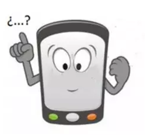

## Enunciado

A Jaime, mientras estaba en el cine, se le ha quedado el móvil sin batería, y ahora no recuerda el número PIN (4 cifras) para poder encenderlo, aunque sí que se acuerda de algunas cosas:

- Las cifras son todas distintas y la suma de todas es múltiplo de tres.
- La cifra de las centenas es doble de la cifra de las unidades.
- La cifra de las unidades de millar es triple de la de las decenas.

¿Estos datos serán suficientes para ayudar a Jaime a encontrar el PIN de su teléfono? Recuerda que tienes tres intentos antes de que se bloquee el teléfono.

**Razona tus respuestas.**

## Solución

Ninguna cifra puede ser 0: el doble o el triple de 0 es 0 y se repetiría.

- Centenas doble de unidades: las parejas (centenas, unidades) posibles son (2, 1), (4, 2), (6, 3) y (8, 4).
- Millares triple de decenas: las parejas (millares, decenas) son (3, 1), (6, 2) y (9, 3).

Combinándolas salen doce números: 3211, 3412, 3613, 3814, 6221, 6422, 6623, 6824, 9231, 9432, 9633 y 9834. Quitando los que repiten cifras quedan 3412, 3814, 6824, 9231, 9432 y 9834, y de ellos solo los que empiezan por 9 tienen una suma de cifras múltiplo de 3 (15, 18 y 24).

El PIN es **9231, 9432 o 9834**: con tres intentos, Jaime podrá encender el teléfono seguro.
