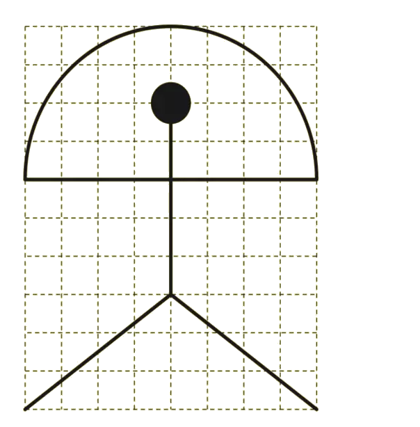
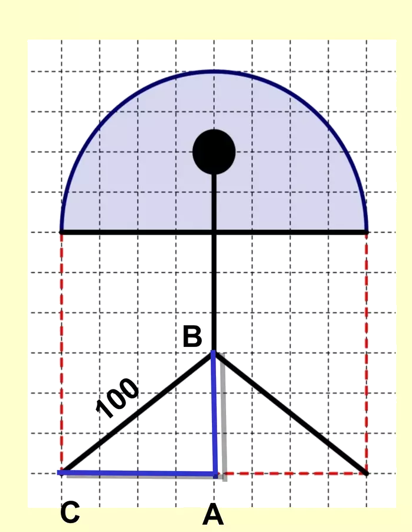

## Enunciado

En la imagen de arriba tienes un indalo, una figurilla prehistórica que era considerada símbolo de buena suerte y que se usaba contra el mal de ojo. Se encontró hace muchos años en una cueva de la provincia de Almería y representa a una persona con los brazos abiertos y un arco sobre su cabeza.

Doña Eulerina, la profesora de matemáticas, ha pedido a sus alumnos y alumnas que construyan en el patio un indalo gigante, como el del gráfico, utilizando latas de refresco que tienen de diámetro de la base 56 mm.

a) Si la pierna del indalo debe medir 1 metro, ¿cuál es la distancia desde el centro de la cabeza hasta el punto de unión de las piernas? ¿Cuánto miden los brazos de la figura?

b) Calcula cuántas latas harían falta para representar el arco y cuántas se necesitarían para rellenar la cabeza del indalo.

**Razona las respuestas.**

## Solución

a) Sobre la cuadrícula, la pierna es la hipotenusa de un triángulo rectángulo de catetos 3 y 4 cuadrículas. Si la cuadrícula mide $x$, por Pitágoras

$$(3x)^2 + (4x)^2 = 100^2 \;\Rightarrow\; 25x^2 = 10\,000 \;\Rightarrow\; x = 20 \text{ cm}.$$

La distancia del centro de la cabeza al punto de unión de las piernas es de 5 cuadrículas, **100 cm** (igual que la pierna: ambas son radios de una misma circunferencia centrada en ese punto), y cada brazo mide 4 cuadrículas, **80 cm**.

b) El arco es una semicircunferencia de radio 80 cm, de longitud $\pi \cdot 80 \approx 251{,}2$ cm $= 2512$ mm. Harán falta unas $2512 : 56 \approx 45$ **latas** (algunas más o menos según cómo se adapten a la curvatura).

La cabeza es un círculo de 20 cm (200 mm) de diámetro. Dividiendo su área entre la de la base de una lata,

$$\frac{\pi \cdot 100^2}{\pi \cdot 28^2} \approx 12{,}8,$$

con **13 latas** hay de sobra. Pero si se colocan sin que sobresalgan del contorno, en el diámetro caben solo 3 latas ($3 \cdot 56 = 168$ mm) y bastan **7 latas** (una en el centro y seis alrededor).
