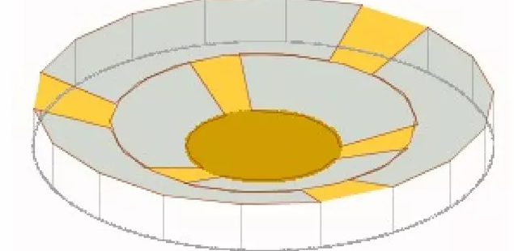
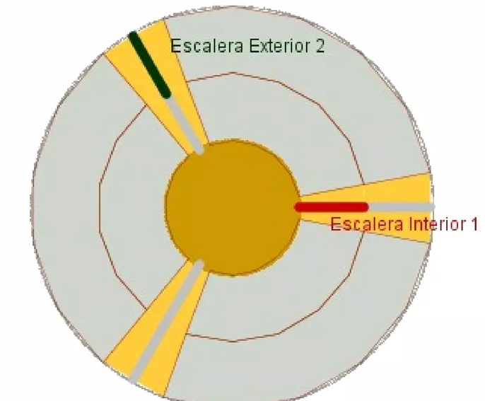

## Enunciado

Manolín: «¡Qué guay! Acaba de llegar el circo Galileo a la ciudad. Este año trae muchísimas novedades:

- amplía su función a dos horas,
- tiene dos gradas con 3 escaleras,
- y las gradas comienzan a girar al inicio del espectáculo».

Pedrín: «¡Cómo! ¿Se mueven los asientos?».

Manolín: «Comienzan a girar en el mismo sentido lentamente para que podamos ver el escenario desde todos los ángulos. Los asientos más cercanos a la pista dan dos vueltas durante el espectáculo, mientras que los externos solo dan una vuelta».

¿Cada cuánto tiempo estarán los pasillos completamente alineados?

**Razona la respuesta.**

## Solución

Vistas desde arriba, las dos gradas son dos coronas circulares, y las 3 escaleras de cada una las dividen en tres trozos iguales de $120°$. Los pasillos están alineados cuando las escaleras de la grada interior coinciden con las de la exterior.

En los 120 minutos del espectáculo, la grada interior gira $2 \cdot 360° = 720°$, a $6°$ por minuto, y la exterior $360°$, a $3°$ por minuto.

Es un problema de alcance: la grada interior se acerca a la exterior a $6 - 3 = 3°$ por minuto, y entre una escalera de la grada exterior y la siguiente hay $120°$. Por tanto, una escalera interior alcanza a la siguiente escalera exterior al cabo de

$$t = \frac{120°}{3°/\text{min}} = 40 \text{ minutos}.$$

Algebraicamente: tomando como referencia la posición inicial de una escalera interior, al cabo de $x$ minutos esta está a $6x$ grados y la escalera exterior siguiente a $120 + 3x$; se alinean cuando $6x = 120 + 3x$, es decir, $x = 40$. (Es el punto de corte de las gráficas de $y = 6x$ e $y = 120 + 3x$.)

Los pasillos estarán completamente alineados **cada 40 minutos**.
