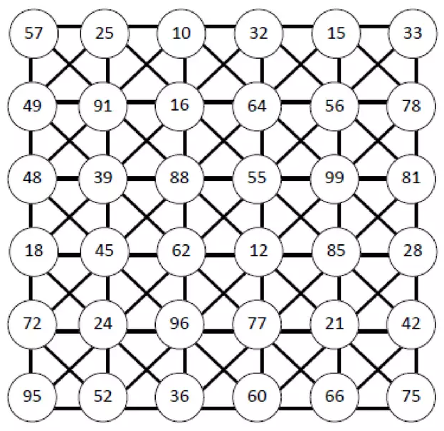
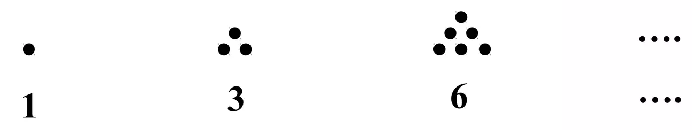
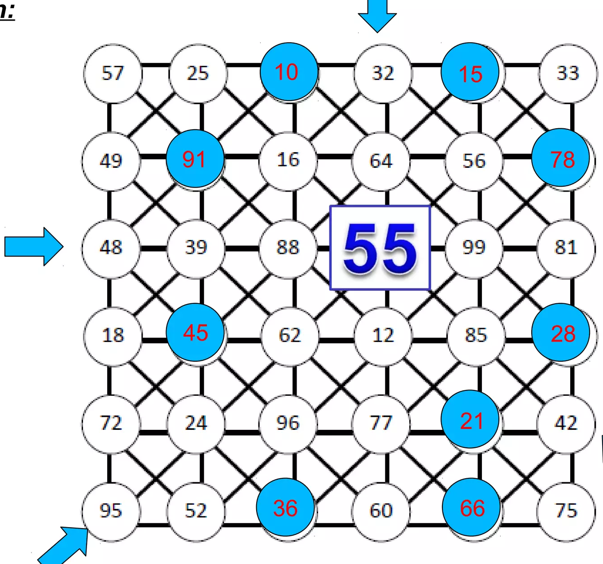

## Enunciado

La última tarea encomendada a Pedrito Buscalotodo consiste en averiguar todos los números triangulares de dos dígitos.

Indícale de **forma razonada** cuáles son estos números y échale una mano para localizarlos en la trama de la figura.

Encuentra cuál es el único número triangular que no coincide con otro en las líneas que pasan a través de él.

Recuerda que los números triangulares son aquellos que responden a la secuencia:

## Solución

Cada número triangular se obtiene sumando al anterior una unidad más que la vez anterior: $1, 3 = 1 + 2, 6 = 3 + 3, 10 = 6 + 4, \dots$ Continuando la secuencia,

$$6 \xrightarrow{+4} 10 \xrightarrow{+5} 15 \xrightarrow{+6} 21 \xrightarrow{+7} 28 \xrightarrow{+8} 36 \xrightarrow{+9} 45 \xrightarrow{+10} 55 \xrightarrow{+11} 66 \xrightarrow{+12} 78 \xrightarrow{+13} 91 \xrightarrow{+14} 105,$$

los números triangulares de dos cifras son **10, 15, 21, 28, 36, 45, 55, 66, 78 y 91**.

Marcándolos en la trama y revisando las líneas horizontal, vertical y diagonales que pasan por cada uno, el único que no comparte ninguna línea con otro número triangular es el **55**.

