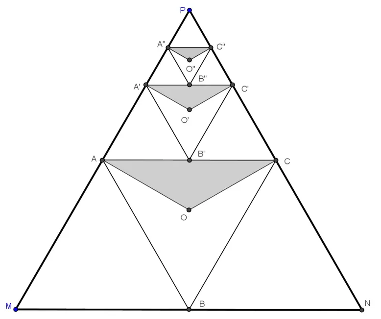

## Enunciado

A Rocío e Isa les gustan mucho unas figuras geométricas llamadas fractales, y les proponen a sus compañeros que les ayuden a resolver el siguiente problema con el fractal que ellas mismas han construido.

Se considera un triángulo equilátero MNP de área 1 m².

Primer paso: en el triángulo MNP se forma el triángulo ABC uniendo los puntos medios de sus lados y, a continuación, se trazan segmentos que unen, respectivamente, los vértices A y C con el baricentro O, creando así el triángulo de color OAC.

Segundo paso: se repite el proceso con el triángulo PAC.

Y así sucesivamente.

a) ¿Cuál es el área del triángulo de color O''A''C'' creado en el paso tercero?

b) ¿Cuál es la suma de las áreas de los triángulos de color del fractal construido desde el primero hasta el cuarto paso incluido?

c) Una vez superada esta prueba, y sabiendo que un FRACTAL es un objeto geométrico cuya estructura básica, regular o irregular, se repite a todas las escalas, dibuja otro fractal diferente del anterior.

**Razona las respuestas.**

## Solución

a) Al unir los puntos medios, el triángulo MNP queda dividido en cuatro triángulos iguales, así que ABC mide $\frac{1}{4}$ m². Las tres rectas que unen el baricentro con los vértices dividen ABC en tres triángulos de igual área, por lo que el triángulo de color AOC mide $\frac{1}{3} \cdot \frac{1}{4} = \frac{1}{12}$ m².

En el segundo paso se parte del triángulo PAC, que mide $\frac{1}{4}$ m², así que A'B'C' mide $\frac{1}{4^2} = \frac{1}{16}$ m² y el triángulo de color, $\frac{1}{3} \cdot \frac{1}{16} = \frac{1}{48}$ m². En general, el triángulo de color del paso $n$ mide $\frac{1}{3} \cdot \frac{1}{4^n}$ m². El del paso tercero mide

$$\frac{1}{3} \cdot \frac{1}{4^3} = \frac{1}{192} \text{ m}^2.$$

b) El del cuarto paso mide $\frac{1}{3} \cdot \frac{1}{4^4} = \frac{1}{768}$ m², y la suma es

$$\frac{1}{12} + \frac{1}{48} + \frac{1}{192} + \frac{1}{768} = \frac{64 + 16 + 4 + 1}{768} = \frac{85}{768} \text{ m}^2.$$

c) Respuesta abierta. Por ejemplo, en cada paso se puede colorear la mitad del triángulo ABC (el triángulo formado por un lado y el punto medio del lado opuesto) y repetir en el triángulo PAC: los triángulos de color miden $\frac{1}{2} \cdot \frac{1}{4} = \frac{1}{8}$, $\frac{1}{2} \cdot \frac{1}{4^2} = \frac{1}{32}$, … y, en general, $\frac{1}{2} \cdot \frac{1}{4^n}$ m².
