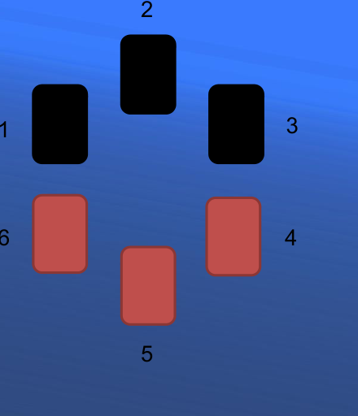

## Enunciado

A Antonio le han regalado una entrada para el cine. Para decidir a cuál de sus dos hijos, Benito o Carmen, dársela, les plantea el siguiente juego:

«Sin que me hayáis visto, he dispuesto seis cartas boca abajo, formando un círculo. El dorso de todas ellas es azul, pero tres de ellas son rojas en su cara frontal y tres son negras. Las he colocado de tal forma que las de cada color estén consecutivas.

Pues bien, el juego consistirá en que Benito dará la vuelta a una de ellas. Si la carta es roja, perderá la entrada de cine. En otro caso, siguiendo el sentido de las agujas del reloj, Carmen dará la vuelta a la siguiente carta. Si es roja, perderá la entrada. Si es negra, Benito girará la siguiente carta, y así sucesivamente hasta que alguien encuentre una carta roja, siendo entonces quien pierda la entrada de cine».

Llegados a este punto, Carmen le preguntó a su padre el motivo por el que empezaba Benito y no ella.

Para saber si la protesta tiene fundamento, contesta a la siguiente pregunta: ¿tienen las mismas posibilidades de ganar ambos? Si la respuesta es negativa, ¿quién tiene más posibilidades de ganar: el que empieza primero o el segundo?

**Razona las respuestas.**

## Solución

Numeramos las cartas en el sentido de las agujas del reloj de modo que las negras sean la 1, la 2 y la 3, y las rojas, la 4, la 5 y la 6. Estudiamos qué pasa según la carta que elija Benito (B) y las que va levantando cada uno:

| Carta inicial | Secuencia | Pierde |
|---|---|---|
| 1 | B negra, C negra, B negra, C roja | Carmen |
| 2 | B negra, C negra, B roja | Benito |
| 3 | B negra, C roja | Carmen |
| 4, 5 o 6 | B roja | Benito |

Benito gana en 2 de los 6 casos y Carmen en 4: **no tienen las mismas posibilidades**. Gana con más probabilidad **el segundo** (Carmen, $\frac{4}{6}$ frente a $\frac{2}{6}$), así que la protesta de Carmen no tiene fundamento.
