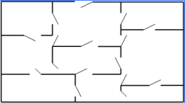
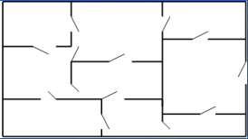
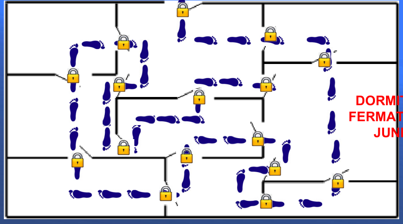
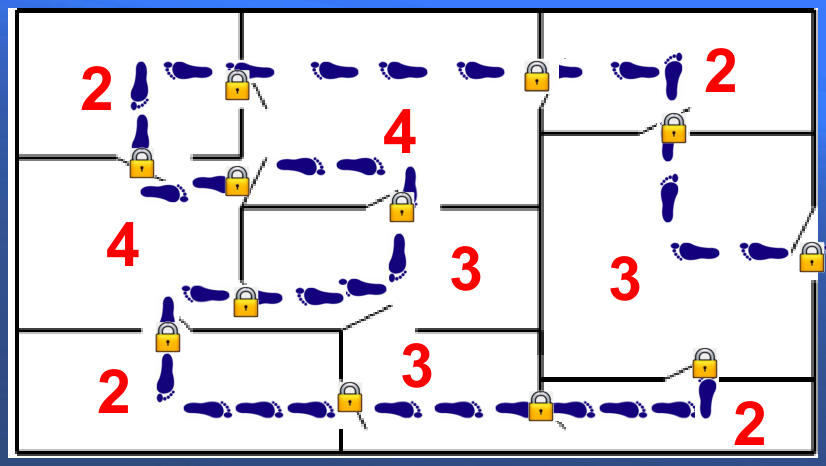

## Enunciado

El matemático Fermathales Junior va a visitar a su padre, también matemático, para enseñarle los planos de su nueva vivienda. Le cuenta que cada noche, al llegar a casa, va atravesando y cerrando con llave cada una de las puertas por donde pasa, sin volver a abrir ninguna de las puertas que ha cerrado, hasta llegar a su dormitorio, **después de haber pasado por todas las puertas**, donde queda encerrado con todas las llaves.

Viendo este plano de la casa del hijo, ¿podrías ayudar al matemático a encontrar el dormitorio de su hijo?

¿Podría cambiar su hijo el dormitorio de lugar cumpliéndose las mismas condiciones?

El padre, una vez descubierto el dormitorio de Fermathales Junior, se pregunta, mirando ahora el plano de su vivienda, si podría hacer lo mismo en su casa.

- ¿Crees que podría?
- En caso de que no pudiera, ¿qué pequeña modificación tendría que realizar en su casa para poder hacerlo?

**Razona las respuestas.**

## Solución

Cada vez que Fermathales entra en una habitación por una puerta y sale por otra, cierra dos de sus puertas. Por eso, una habitación por la que solo pasa tiene que tener un número par de puertas (2, 4, 6…: entra y sale una, dos, tres… veces). En cambio, en el dormitorio entra una vez más de las que sale y se queda dentro: el dormitorio tiene que tener un **número impar de puertas**.

**Casa del hijo.** Contando las puertas de cada habitación, todas tienen un número par salvo una, que tiene 5: ese es el dormitorio. Un posible recorrido es el de la figura. El hijo **no puede cambiar el dormitorio** de habitación, porque es la única con un número impar de puertas.

**Casa del padre.** Hay tres habitaciones con un número impar de puertas (3 cada una), así que el padre **no puede** hacer lo mismo.

Para poder hacerlo tendría que dejar una sola habitación con un número impar de puertas. Por ejemplo:

1. Abrir una puerta nueva entre las dos habitaciones contiguas de 3 puertas, que pasan a tener 4; la tercera habitación de 3 puertas sería el dormitorio.
2. Tabicar la puerta que comparten esas dos habitaciones, que pasan a tener 2; el dormitorio sería la otra habitación de 3 puertas (aunque sea la de la entrada de la casa).
