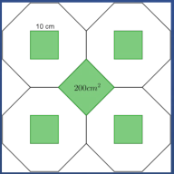

## Enunciado

La empresa de azulejos Porcelatodo va a inaugurar una nueva fábrica en Todolandia y por dicho motivo ha lanzado al mercado un nuevo diseño de azulejos blancos de forma octogonal irregular con un cuadrado de color verde de lado 10 cm en el centro del mismo (como puede observarse en el dibujo).

El famoso escaparatista D. Esbelto Decoralotodo, para el día de la inauguración, quiere preparar un panel expositor de 2,25 m² de superficie. Dicho panel estaría recubierto con los nuevos azulejos y, para cubrir los huecos que se forman al unir estos azulejos, utiliza otras piezas de color verde y de forma cuadrada de 200 cm² cada una (como se ve en el dibujo), que pueden ser troceadas.

¿Qué superficie ocupa el azulejo octogonal?

¿Cuántos azulejos octogonales y cuántas piezas cuadradas necesitará D. Esbelto Decoralotodo para recubrir todo el panel expositor?

**Razona las respuestas.**

## Solución

El azulejo se puede dividir en cuadrados iguales al cuadrado verde, de 10 cm de lado: 5 cuadrados enteros (el central y los cuatro de los lados) y 4 mitades en las esquinas, en total el equivalente a 7 cuadrados. Su área es

$$7 \cdot 10^2 = 700 \text{ cm}^2.$$

El panel mide $2{,}25 \text{ m}^2 = 22\,500 \text{ cm}^2$; si es cuadrado, su lado es $\sqrt{22\,500} = 150$ cm. Cada azulejo ocupa $10 + 10 + 10 = 30$ cm de ancho y de alto, así que en cada lado caben $150 : 30 = 5$ azulejos: hacen falta $5 \cdot 5 = 25$ **azulejos octogonales**.

Los huecos entre azulejos son las piezas cuadradas: hay 4 filas de 4 piezas completas y dos mitades en los extremos ($4 + 2 \cdot \frac{1}{2} = 5$ piezas por fila) y, en los bordes de arriba y de abajo, 2 filas de 4 mitades y 2 cuartos ($4 \cdot \frac{1}{2} + 2 \cdot \frac{1}{4} = 2{,}5$). En total, $4 \cdot 5 + 2 \cdot 2{,}5 = 25$ **piezas cuadradas**.

Comprobación: $25 \cdot 700 + 25 \cdot 200 = 17\,500 + 5000 = 22\,500 \text{ cm}^2$, que es la superficie del panel.
