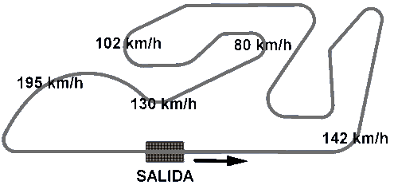
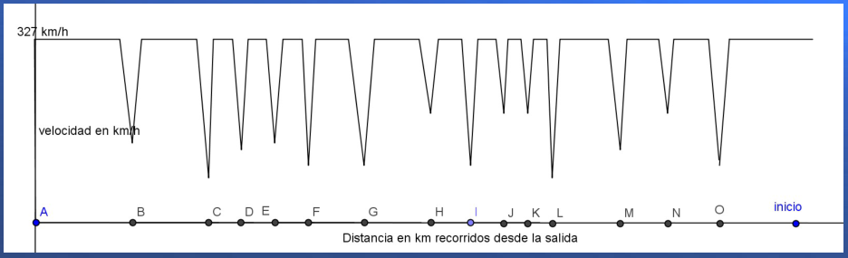

## Enunciado

El equipo de Marc Márquez, para conseguir el título del Mundial de MotoGP del año 2013, estuvo preparándose para obtener la victoria en la última prueba; por este motivo tenían en cuenta las velocidades que se pueden alcanzar en cada una de las curvas del circuito Ricardo Tormo de la Comunidad Valenciana.

Representa, en unos ejes distancia-velocidad, la gráfica que muestre la velocidad que pudo llevar Marc en cada uno de los tramos del circuito, a partir de la segunda vuelta, para sacar el máximo rendimiento a la carrera. Para ello puedes utilizar los siguientes datos:

- Circuito Ricardo Tormo. Longitud: 4005 m.
- Curvas: 14.
- Recta más larga: 876 m.
- Velocidad máxima: 327 km/h.

## Solución

Marcamos en el circuito el punto de máxima curvatura de cada una de las 14 curvas (B, C, …, O) y el punto de salida A, donde empieza la segunda vuelta.

Al pasar por A, en la recta de meta, Marc lleva la velocidad máxima, 327 km/h. Antes de la curva B debe frenar hasta 142 km/h, aminorando progresivamente hasta el punto de máxima curvatura, y luego acelerar de nuevo en la recta siguiente, y así en cada curva. Las velocidades de las curvas que no da el dibujo se estiman comparándolas con otras parecidas (por ejemplo, C es aproximadamente tan cerrada como L, la de 80 km/h).

Las distancias se miden sobre el plano, por ejemplo con un compás o aproximando el circuito por una poligonal, y se toma como escala la recta más larga, de 876 m. Llevando en el eje de abscisas la distancia recorrida desde la salida y en el de ordenadas la velocidad, la gráfica tiene una forma como esta: tramos a velocidad alta en las rectas y «valles» en cada curva, más profundos cuanto más cerrada es la curva.

Se admiten distintos trazados (por ejemplo, con subidas y bajadas más suaves si se tienen en cuenta las aceleraciones y frenadas), siempre que se explique cómo se han obtenido a partir de los datos.
