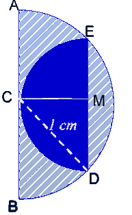

## Enunciado

D. Esbelto Decoralotodo está diseñando, con motivo del próximo eclipse de Luna, un nuevo elemento decorativo para todos los escaparates de todas las tiendas de Todolandia.

Como se puede observar en la figura, el diseño consiste en la Luna en cuarto menguante inscrita en la Luna en cuarto creciente. Cada una de ellas está representada por medio disco, de centros M y C, respectivamente.

Sabiendo que los dos diámetros $\overline{AB}$ y $\overline{DE}$ son paralelos, y que el radio de la mayor es 1 cm, ¿cuál es el área de la parte rayada en el dibujo?

**Razona la respuesta.**

## Solución

La Luna creciente es medio círculo de radio 1 cm, de área $\frac{\pi \cdot 1^2}{2} = \frac{\pi}{2}$ cm².

El radio $r$ de la Luna menguante es $MD = MC$. El triángulo $CMD$ es rectángulo en $M$ (porque $CM$ es perpendicular a $DE$) y su hipotenusa $CD$ es un radio de la Luna grande, de 1 cm. Por el teorema de Pitágoras,

$$1^2 = MD^2 + MC^2 = 2r^2 \;\Rightarrow\; r^2 = \frac{1}{2}.$$

La Luna menguante mide $\frac{\pi r^2}{2} = \frac{\pi}{4}$ cm², y la parte rayada es la diferencia:

$$\frac{\pi}{2} - \frac{\pi}{4} = \frac{\pi}{4} \approx 0{,}785 \text{ cm}^2.$$
