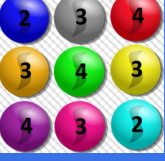

## Enunciado

En Matelandia se va a organizar una tómbola y para ello se presentan las bolas con números del dibujo, que se introducen en una urna cerrada. Se extraen dos bolas simultáneamente y se procede a multiplicar sus números.

Pitagorín y su primo Fermín van a jugar y les ofrecen tres tarjetas para que elijan una antes de proceder a la extracción de las bolas, pero no saben cuál elegir:

- Tarjeta 1: «El resultado del producto es un número impar».
- Tarjeta 2: «Los dos números extraídos son diferentes».
- Tarjeta 3: «El resultado del producto es un cuadrado perfecto».

¿Qué tarjeta deberán escoger para tener más posibilidades de ganar en el juego?

**Razona la respuesta.**

## Solución

Hay 9 bolas distintas (de distinto color): dos con el 2, cuatro con el 3 y tres con el 4. Al sacar dos a la vez, el orden no importa: la primera bola puede emparejarse con 8, la siguiente con 7 nuevas, etc., así que hay

$$8 + 7 + 6 + 5 + 4 + 3 + 2 + 1 = 36$$

parejas posibles.

- **Tarjeta 1.** El producto es impar si las dos bolas son impares, es decir, dos de las cuatro bolas con el 3: $3 + 2 + 1 = 6$ parejas.
- **Tarjeta 3.** Con estos números, el producto es un cuadrado perfecto solo si los dos números son iguales: 1 pareja de doses, $3 + 2 + 1 = 6$ de treses y $2 + 1 = 3$ de cuatros, en total 10 parejas.
- **Tarjeta 2.** Los números son diferentes en todas las demás parejas: $36 - 10 = 26$.

Deben escoger la **tarjeta 2**, que gana en 26 de los 36 casos.
