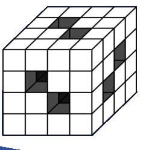

## Enunciado

El profesor le solicita a Ángel que diseñe una red de túneles. Esta es la propuesta: «El sólido de la figura es un gran cubo que está formado por cubos pequeños y atravesado por seis túneles horizontales o verticales».

Sabiendo que cada túnel va de una cara a su opuesta, ¿cuántos cubos pequeños forman el sólido?

**Razona la respuesta.**

## Solución

Si el cubo estuviera completo tendría $4 \cdot 4 \cdot 4 = 64$ cubos pequeños. Hay dos túneles en cada dirección; los quitamos uno a uno, teniendo cuidado de no contar dos veces los cubitos en los que se cruzan dos túneles:

1. Los dos túneles que atraviesan el cubo de delante a atrás quitan 4 cubitos cada uno: quedan $64 - 2 \cdot 4 = 56$.
2. Cada uno de los dos túneles verticales se cruza con uno de los anteriores, así que solo quita 3 cubitos nuevos: quedan $56 - 2 \cdot 3 = 50$.
3. Lo mismo ocurre con los dos túneles de izquierda a derecha: quedan $50 - 2 \cdot 3 = 44$.

En total se han quitado $8 + 6 + 6 = 20$ cubitos, y el sólido está formado por $64 - 20 = 44$ **cubos pequeños**.
