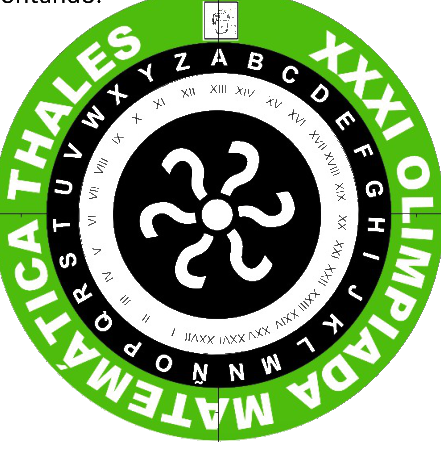

## Enunciado

Lola y sus amigas quieren mandarse por WhatsApp mensajes cifrados para que, si alguien los lee, no se enteren de lo que se están contando.

Cada una de ellas tiene un disco cifrante como el que tenéis en la mesa. Ellas ya han acordado que cada día van a hacer corresponder a la letra A el número del día del mes en el que estén; si es mayor de 27, siguen contando. Así, a la letra A le corresponderá el número XIII los días 13, y el número III los días 3 y 30.

Si quieren mandar el mensaje HOLA el día 13 de enero, escribirían: XXIXXIVXIII.

a) El día 5 de febrero Lola recibió de su amiga Paloma el siguiente mensaje:

XXVIIXXIII V XVIV XXXVIXIIIXVIIXXIXIIIVVIIIV, ¿III XXVXXVI?

Descífralo para saber qué le decía Paloma en él.

b) En la mañana de hoy, día de la Olimpiada Matemática Thales (14 de marzo), Lola ha vuelto a recibir un mensaje de Paloma: VIVIIIXVIIIVVIIXVIII. ¿Qué le dice Paloma en este nuevo mensaje?

c) Si quiere contestar al mensaje recibido con la palabra GRACIAS, ¿cómo sería el mensaje cifrado que tendría que mandarle Lola a Paloma?

## Solución

El disco tiene las 27 letras del alfabeto (A, B, …, N, Ñ, O, …, Z). Si el día $d$ la A corresponde al número $d$, la letra que ocupa el lugar $k$ (A = 0, B = 1, …, Z = 26) corresponde a $d + k$, restando 27 si se pasa de 27. Por ejemplo, el 13 de enero: H $\to 13 + 7 = 20$ (XX), O $\to 13 + 15 = 28 \to 1$ (I), L $\to 24$ (XXIV) y A $\to 13$ (XIII).

a) El 5 de febrero la A es el V. Separando los números romanos de cada palabra:

- XXVII · XX · III $\to$ 27, 20, 3 $\to$ V, O, Y
- V $\to$ A
- XVI · V $\to$ L, A
- XX · XVI · XIII · XVII · XXI · XIII · V · VIII · V $\to$ O, L, I, M, P, I, A, D, A
- III $\to$ Y; XXV · XXVI $\to$ T, U

El mensaje es **«VOY A LA OLIMPIADA, ¿Y TÚ?»**.

b) El 14 de marzo la A es el XIV. VI · VIII · XVIII · V · VII · XVIII son 6, 8, 18, 5, 7, 18, que corresponden a S, U, E, R, T, E: el mensaje es **«SUERTE»**.

c) Con la A en el XIV: G $\to$ XX, R $\to$ V, A $\to$ XIV, C $\to$ XVI, I $\to$ XXII, A $\to$ XIV, S $\to$ VI. El mensaje es **XXVXIVXVIXXIIXIVVI**.
