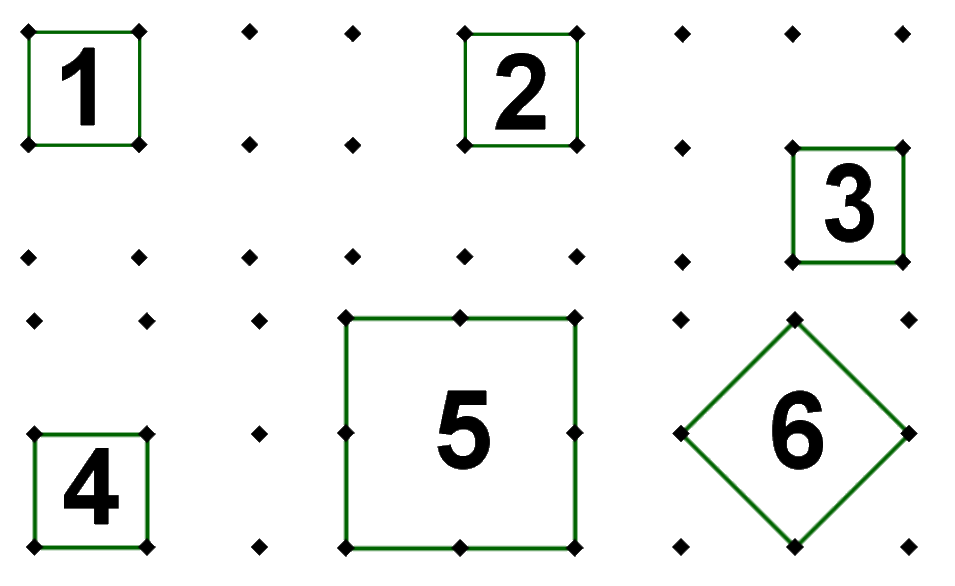

## Enunciado

Javier está muy preocupado con el patrón de desbloqueo de su móvil, el de los nueve puntos. Se trata de unir los puntos que se deseen, acabando siempre en el primero que se elija.

Como es un enamorado de la Geometría, le propone a su amigo Jesús que encuentre todos los patrones que formen cuadrados. ¿Cuántos cuadrados distintos pueden formarse?

Jairo, un tercer amigo de Javi y Jesús, les dice que solo con las dos primeras líneas de puntos se pueden formar más triángulos que cuadrados con todos los puntos. ¿Tiene razón Jairo? ¿Cuántos triángulos ha encontrado?

**Justifica todas tus respuestas.**

## Solución

Los nueve puntos forman una cuadrícula de $3 \times 3$. Se pueden formar **6 cuadrados**: 4 pequeños (de lado 1), 1 grande (de lado 2) y 1 inclinado, con vértices en los puntos medios de los lados.

Con las dos primeras filas hay 6 puntos. Tres puntos cualesquiera forman un triángulo salvo que estén alineados, y solo hay dos tríos alineados (cada una de las dos filas). Como con 6 puntos se pueden elegir $\frac{6 \cdot 5 \cdot 4}{6} = 20$ tríos, hay $20 - 2 = 18$ **triángulos**: 9 con dos vértices en la fila de arriba y 9 con dos vértices en la de abajo.

Jairo **tiene razón**: 18 triángulos frente a 6 cuadrados.
