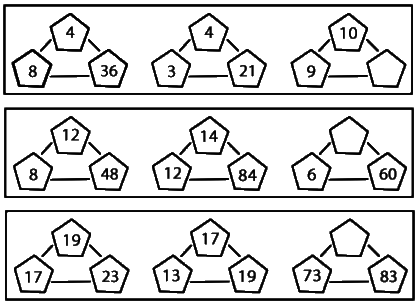

## Enunciado

Pitagorina es un poco coqueta y no quiere revelarnos su edad, ni la de su marido (mayor que ella), ni la de su hija Alejandra. Como hemos insistido mucho, ha aceptado darnos una pista:

«Si averiguáis los números que faltan en cada uno de los pentágonos del dibujo, sabréis nuestras edades».

¿Cuántos años tiene cada uno de los integrantes de la familia de Pitagorina?

**Explica cómo has obtenido sus edades.**

## Solución

En cada fila, los tres grupos siguen la misma regla:

- **Primera fila.** El número de la derecha es la suma de los otros dos multiplicada por 3: $(4 + 8) \cdot 3 = 36$, $(4 + 3) \cdot 3 = 21$. Falta $(10 + 9) \cdot 3 = 57$.
- **Segunda fila.** El de la derecha es la mitad del producto de los otros dos: $\frac{12 \cdot 8}{2} = 48$, $\frac{14 \cdot 12}{2} = 84$. Falta el número de arriba: $\frac{x \cdot 6}{2} = 60$, $x = 20$.
- **Tercera fila.** Son tres primos consecutivos, con el de arriba en medio: 17, 19, 23 y 13, 17, 19. El primo que va entre 73 y 83 es 79.

Las edades son 57, 20 y 79. Como el marido es mayor que Pitagorina y Alejandra es la hija, **Pitagorina tiene 57 años, su marido 79 y Alejandra 20**.
