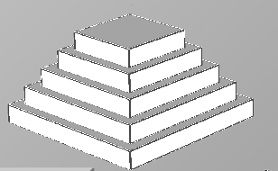
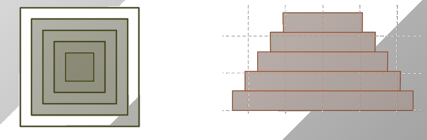

## Enunciado

El famoso arqueólogo Indiana Barrow está estudiando la conocida pirámide de Topolicán, que está construida por distintos prismas de base cuadrada, con la superficie externa recubierta de oro. Indiana ha escrito en su cuaderno de notas los siguientes datos:

- La base del monumento es un prisma cuadrangular de 9,72 m de lado, el prisma situado en lo más alto es otro cuadrangular que tiene 4,28 m de lado y la altura total del monumento es de 5,25 m.
- Todos los prismas tienen la misma altura y los lados de sus caras cuadradas decrecen regularmente (o, lo que es lo mismo, su diferencia entre dos caras consecutivas es constante).

Calcula, razonando la respuesta, la superficie de oro que tiene la pirámide de Topolicán.

## Solución

La pirámide tiene 5 prismas. Si la miramos desde arriba vemos todos los cuadrados dentro del más grande, y desde cada uno de los cuatro lados, cinco rectángulos apilados:

**Vista desde arriba.** Las partes horizontales de todos los escalones juntas forman el cuadrado de la base: $9{,}72^2 = 94{,}4784 \approx 94{,}48$ m².

**Vista lateral.** Cada rectángulo mide $5{,}25 : 5 = 1{,}05$ m de alto. Los lados disminuyen de 9,72 a 4,28 m en 4 saltos iguales: $(9{,}72 - 4{,}28) : 4 = 1{,}36$ m. Los anchos son 4,28; 5,64; 7; 8,36 y 9,72 m, y el área de un lateral es

$$1{,}05 \cdot (4{,}28 + 5{,}64 + 7 + 8{,}36 + 9{,}72) = 1{,}05 \cdot 35 = 36{,}75 \text{ m}^2.$$

(Es lo mismo que el área del trapecio de bases 9,72 y 4,28 m y altura 5,25 m: $\frac{(9{,}72 + 4{,}28) \cdot 5{,}25}{2} = 36{,}75$ m².)

Los cuatro laterales miden $4 \cdot 36{,}75 = 147$ m², y la superficie de oro es

$$147 + 94{,}48 = 241{,}48 \text{ m}^2.$$
