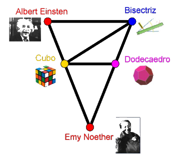

## Enunciado

En Matelandia se ha puesto en marcha un carril bici con cinco paradas: Albert Einstein, Bisectriz, Cubo, Dodecaedro y Emy Noether. Su trazado es el que puedes ver en la figura.

**Contesta razonando la respuesta:** ¿cuántos recorridos distintos pueden hacerse para ir de Albert Einstein a Emy Noether?

Has de tener en cuenta que la bici debe ir por los caminos marcados en el circuito y que no se puede recorrer ningún tramo dos veces.

## Solución

Llamamos a las paradas por su inicial: A, B, C, D y E. Los tramos son AB, AC, BC, BD, CD, CE y DE. Con un diagrama de árbol, partiendo de A y siguiendo cada camino hasta llegar a E (o a un punto sin salida), sin repetir tramos, se obtienen estos recorridos:

- Empezando por AB: ABCDE, ABCE, ABDCE, ABDE.
- Empezando por AC: ACBDE, ACDE, ACE, ACBDCE, ACDBCE.

En total hay **9 recorridos** distintos.
