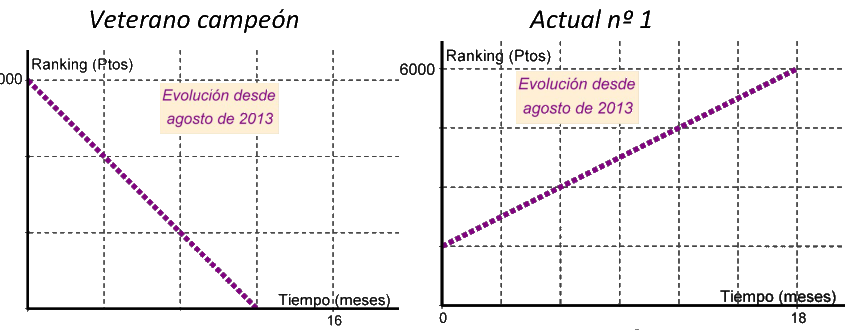

## Enunciado

El verano de 2013 fue una fecha importantísima en la evolución del ranking de los dos mejores deportistas españoles. Según se puede observar en estas informaciones gráficas encontradas en distintos medios de comunicación deportivos, la evolución sufrió un gran cambio.

¿En qué momento el actual número 1 superó en el ranking al veterano campeón?

**Razona la respuesta.**

## Solución

Leyendo las escalas de las gráficas (en la del veterano cada cuadro son 4 meses y 2000 puntos; en la del actual n.º 1, 3 meses y 1500 puntos):

- El veterano baja en línea recta de 6000 puntos (agosto de 2013) a 0 puntos a los 12 meses: pierde 500 puntos al mes, $y = 6000 - 500x$.
- El actual n.º 1 sube en línea recta de 1500 a 6000 puntos en 18 meses: gana 250 puntos al mes, $y = 1500 + 250x$.

Representándolas en los mismos ejes, o igualando,

$$6000 - 500x = 1500 + 250x \;\Rightarrow\; 750x = 4500 \;\Rightarrow\; x = 6,$$

las gráficas se cortan en el punto $(6, 3000)$: a los 6 meses los dos tienen 3000 puntos. A partir de ahí el actual n.º 1 va por delante, así que lo superó **6 meses después de agosto de 2013, en febrero de 2014**.
