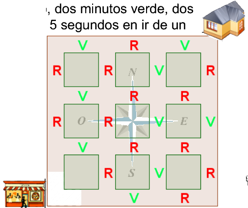
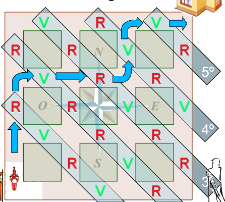

## Enunciado

Giuseppe Peanín, que es el repartidor de la pizzería matelandesa, tiene que entregar un pedido en una casa en el mínimo tiempo posible. Armado de paciencia, ha estudiado minuciosamente los semáforos del barrio y ha descubierto algunas cosas. Los semáforos solo tienen dos colores: rojo (no se puede pasar) y verde (sí se puede pasar), que se alternan cada dos minutos (dos minutos rojo, dos minutos verde, dos minutos rojo…). Giuseppe tarda 2 minutos y 5 segundos en ir de un semáforo al siguiente.

Si en el momento en que sale de cualquiera de las dos salidas del aparcamiento la disposición de los semáforos se acaba de cambiar a la que se indica en el dibujo, ¿cuál es la ruta más rápida para entregar la comida?

**Explica razonadamente tu respuesta.**

## Solución

**Siempre hacia el norte o el este.** Dar la vuelta a una manzana para evitar un semáforo en rojo añade dos tramos, $2 \cdot (2 \text{ min } 5 \text{ s}) = 4$ min 10 s, mientras que esperar en un semáforo cuesta como mucho 2 minutos. Con dos manzanas pasa lo mismo, así que el trayecto más rápido avanza siempre hacia el norte o hacia el este y pasa por 5 semáforos.

**Qué pasa en cada semáforo.** Giuseppe llega al primer semáforo a los 2 min 5 s, cuando todos los semáforos ya han cambiado una vez: pasa sin parar si en el dibujo está en rojo (ahora está en verde) y tiene que esperar si está en verde. Del mismo modo, si pasa un semáforo nada más ponerse en verde, llega al siguiente 5 segundos después de un nuevo cambio: pasa sin parar si el siguiente tenía en el dibujo **distinto color** que el anterior y tiene que esperar casi 2 minutos si tenía **el mismo color**. Cada semáforo sin parar acumula 5 segundos de retraso, que se descuentan de la siguiente espera.

**El trayecto más rápido** es, por tanto, el que empieza con un semáforo rojo (por la salida norte) y tiene el mayor número posible de semáforos consecutivos de distinto color, y, si hay que parar, que la parada sea lo más tarde posible. Comparando todos los trayectos con un diagrama de árbol, hay tres en los que solo se para una vez, y de ellos el más rápido es aquel en el que la parada llega más tarde, el marcado en el plano:

