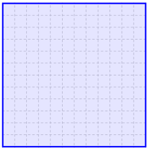
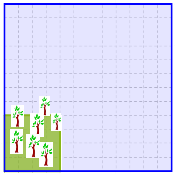

## Enunciado

En Matelandia se preocupan por el medio ambiente.

Para concienciar a su clase de que se debe ahorrar papel, el profesor D. Rosendo muestra a sus alumnos un polígono de la misma forma que la provincia de Matelandia, que, como todos saben, es cuadrada y tiene 1296 km² de superficie. Como a D. Rosendo le interesan mucho las nuevas tecnologías, ha pedido a sus alumnos que busquen información en internet.

Lucas ha encontrado los siguientes datos:

- Superficie mínima que necesita para crecer un árbol del que se obtiene papel: 4 m².
- Cantidad de papel que se fabrica con un árbol: 40 kg.
- Número de habitantes de Matelandia: 9 600 000 hab.
- Cantidad de papel usado por habitante y año en Matelandia: 150 kg.

D. Rosendo les pide que dibujen un cuadrado, sobre el mapa anterior, que represente las dimensiones de la superficie mínima que en Matelandia se destina cada año a la fabricación de papel. ¿Cuáles son las dimensiones de ese cuadrado?

**Razona las respuestas.**

## Solución

Matelandia es un cuadrado de $\sqrt{1296} = 36$ km de lado; como el mapa tiene 12 cuadritos de lado, cada cuadrito representa 3 km.

Cada año se consumen $9\,600\,000 \cdot 150 = 1\,440\,000\,000$ kg de papel, que necesitan $1\,440\,000\,000 : 40 = 36\,000\,000$ árboles. Estos ocupan

$$36\,000\,000 \cdot 4 = 144\,000\,000 \text{ m}^2 = 144 \text{ km}^2.$$

Un cuadrado de 144 km² tiene $\sqrt{144} = 12$ km de lado: en el mapa, **un cuadrado de 4 × 4 cuadritos**.

