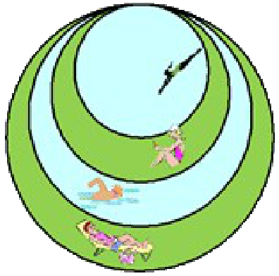

## Enunciado

Sofía Germain es la presidenta de una comunidad de vecinos. Gracias a una subvención, ha construido en la urbanización una zona con césped y dos piscinas (las dos partes más claras que se muestran en el dibujo). Esta nueva construcción, como puede apreciarse, está formada por círculos tangentes entre sí en un punto. El círculo más pequeño tiene 6 metros de diámetro y cada círculo tiene un metro de radio más que el anterior.

¿Qué hay más, agua o césped?

**Contesta razonando tu respuesta.**

## Solución

Los cuatro círculos tienen radios 3, 4, 5 y 6 m, y sus áreas son $9\pi$, $16\pi$, $25\pi$ y $36\pi$ m².

- **Piscinas:** el círculo pequeño y la corona entre el tercero y el segundo: $9\pi + (25\pi - 16\pi) = 18\pi$ m².
- **Césped:** la corona entre el segundo y el primero y la corona entre el cuarto y el tercero: $(16\pi - 9\pi) + (36\pi - 25\pi) = 7\pi + 11\pi = 18\pi$ m².

¡Sorprendente! **Hay la misma cantidad de agua que de césped**, $18\pi \approx 56{,}5$ m² de cada.
