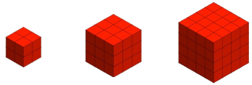

## Enunciado

Eva le dice a Beatriz: «Tengo un buen montón de cubitos de 1 cm de arista y con ellos he formado cubos mayores de 2, 3, 4, 5, 6, 7… cm de arista. A continuación he pintado las seis caras de estos cubos mayores. Adivina cuál es el cubo que tiene la misma cantidad de cubitos con una sola cara pintada que sin ninguna».

¿Cuántos cubitos forman el cubo que tiene que adivinar Beatriz?

**Razona tu respuesta.**

## Solución

En un cubo de arista $n$, los cubitos con alguna cara pintada son los de la superficie.

- Los que tienen **una sola cara pintada** son los del interior de cada cara (sin las aristas): $(n - 2)^2$ por cara, $6\,(n - 2)^2$ en total.
- Los que **no tienen ninguna** forman un cubo interior de arista $n - 2$: $(n - 2)^3$.

| $n$ | 3 | 4 | 5 | 6 | 7 | 8 |
|---|---|---|---|---|---|---|
| Una cara | 6 | 24 | 54 | 96 | 150 | 216 |
| Ninguna | 1 | 8 | 27 | 64 | 125 | 216 |

Igualando, $6\,(n - 2)^2 = (n - 2)^3$, y como $n > 2$, $n - 2 = 6$, es decir, $n = 8$. El cubo está formado por $8^3 = 512$ **cubitos**.
