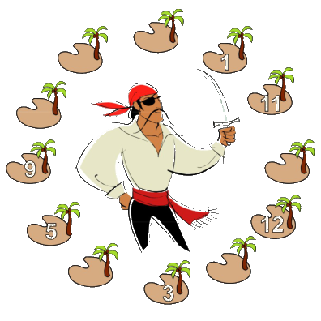
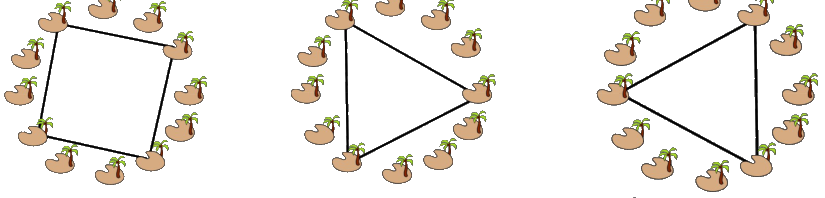
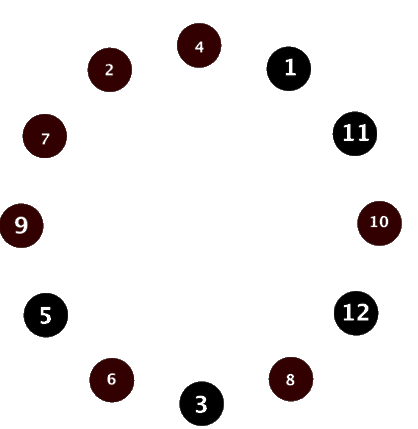

## Enunciado

El pirata Malapata controla todo el Mar de los Números y los tesoros que se encuentran en sus doce islas. En las islas hay desde 1 tesoro hasta 12 tesoros, de forma que dos islas no pueden tener el mismo número de tesoros. Cada semana, Malapata hace distintas expediciones cuadradas y expediciones triangulares para comprobar que sus tesoros no han sido robados (como se muestra en los dibujos A, B y C).

Malapata llama botín de una expedición al número total de tesoros que hay en una expedición. Sabe que el botín de cualquier expedición cuadrada es siempre el mismo, y el botín de cualquier expedición triangular es el mismo que el de su expedición opuesta (véase el dibujo C). Además, sabe que existe una diferencia de 3 tesoros entre el botín de una expedición triangular y cualquiera que no sea su opuesta.

Ayuda a Malapata y completa el dibujo adjunto, donde se muestra el número de tesoros de cada isla.

**Razona cómo lo has hecho.**

## Solución

Llamamos $I_1, \dots, I_{12}$ a las islas según su posición, como las horas de un reloj. Las conocidas son $I_1 = 1$, $I_2 = 11$, $I_4 = 12$, $I_6 = 3$, $I_8 = 5$ e $I_9 = 9$; faltan 2, 4, 6, 7, 8 y 10.

**Expediciones cuadradas.** Las tres expediciones cuadradas ($I_1 I_4 I_7 I_{10}$, $I_2 I_5 I_8 I_{11}$ y $I_3 I_6 I_9 I_{12}$) pasan por las 12 islas sin repetir, así que entre las tres suman $1 + 2 + \dots + 12 = 78$, y cada una tiene un botín de $78 : 3 = 26$. Por tanto:

- $I_7 + I_{10} = 26 - 1 - 12 = 13$: con las cifras que faltan, solo 6 y 7.
- $I_5 + I_{11} = 26 - 11 - 5 = 10$: solo 2 y 8.
- $I_3 + I_{12} = 26 - 3 - 9 = 14$: solo 4 y 10.

**Expediciones triangulares.** Las opuestas $I_2 I_6 I_{10}$ e $I_4 I_8 I_{12}$ tienen el mismo botín: $11 + 3 + I_{10} = 12 + 5 + I_{12}$, es decir, $I_{12} = I_{10} - 3$. La única posibilidad es $I_{10} = 7$ e $I_{12} = 4$; por tanto, $I_7 = 6$ e $I_3 = 10$.

Las opuestas $I_1 I_5 I_9$ e $I_3 I_7 I_{11}$ dan $1 + I_5 + 9 = 10 + 6 + I_{11}$, es decir, $I_5 = I_{11} + 6$: $I_5 = 8$ e $I_{11} = 2$.

| Isla | 1 | 2 | 3 | 4 | 5 | 6 | 7 | 8 | 9 | 10 | 11 | 12 |
|---|---|---|---|---|---|---|---|---|---|---|---|---|
| Tesoros | 1 | 11 | 10 | 12 | 8 | 3 | 6 | 5 | 9 | 7 | 2 | 4 |

Se comprueba la última condición: las expediciones triangulares $I_1 I_5 I_9$ e $I_3 I_7 I_{11}$ tienen un botín de 18 y las otras dos, de 21; la diferencia es 3.
