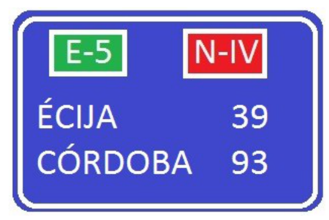

## Enunciado

En la autovía Sevilla–Córdoba nos encontramos la señal de tráfico de la figura, donde las distancias están en kilómetros.

Si nos fijamos en esta señal, observaremos que los números (39 y 93) tienen los mismos dígitos pero cambiados de orden. A este tipo de señal la llamaremos «señal clave».

a) ¿Qué otras «señales clave» Écija–Córdoba podremos encontrar después de la anterior, antes de llegar a Écija?

b) En la misma autovía se encuentra la población de La Carlota, cuya distancia a Córdoba es de 31 km. ¿Podremos encontrar «señales clave» La Carlota–Córdoba antes de llegar a La Carlota?

c) Quiero hacer un viaje de Bailén a Córdoba (100 km); la carretera pasa por Alcolea, y la distancia de Alcolea a Córdoba es de 18 km. ¿Es posible encontrar «señales clave» Alcolea–Córdoba? ¿Cuáles serían?

Razona todas las respuestas.

## Solución

Si restamos los dos números de la señal obtenemos la distancia entre las dos ciudades: de Écija a Córdoba hay $93 - 39 = 54$ km.

En una señal clave con números $\overline{ab}$ y $\overline{ba}$ se cumple siempre

$$(10b + a) - (10a + b) = 9b - 9a = 9\,(b - a),$$

es decir, la distancia entre las dos ciudades tiene que ser múltiplo de 9.

a) Como $9\,(b - a) = 54$, es $b - a = 6$: hay que buscar parejas de cifras que se diferencien en 6. Después de la señal 39/93 vienen las señales **28/82** y **17/71**. La siguiente, 6/60, no vale, porque el primer número no tiene dos cifras.

b) La distancia entre La Carlota y Córdoba es 31 km, que **no es múltiplo de 9**, así que no hay señales clave entre ambas ciudades.

c) Ahora $9\,(b - a) = 18$, luego las cifras se diferencian en 2. Las señales clave son **79/97, 68/86, 57/75, 46/64, 35/53, 24/42 y 13/31**. La señal 2/20 no vale, porque el primer número no tiene dos cifras.
